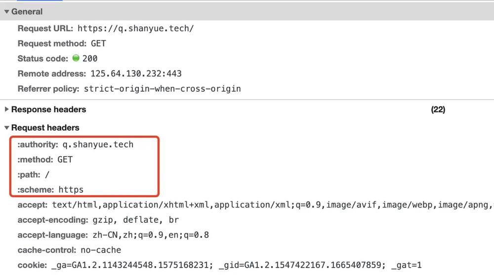

# header

HTTP 中的 Header 虽然接触很多，但是一些规则容易忽略：

1. HTTP Header 名称不区分大小写。因此 Content-Type 与 content-type 并无差别

2. HTTP Header 名称与值由 : 分割，值首部空格将被忽略，更严格地说，是被 `/:\s+/` 分割。因此 A: 3 与 A:&emsp; 3 并无差别。

3. HTTP Header 中的非标准自定义首部由 X- 作为前缀，虽已被废弃，但仍然有大量使用。比如 X-Powered-By，仍被大量服务器框架所使用。

HTTP Header 虽然不区分大小写，但有时也希望获取到原始的 Header，因此在 Node.js 中提供了两个 API：

1. message.headers：对头部全部转化为小写形式返回
2. message.rawHeaders：对头部不做大小写转化进行返回

## pseudo-header (伪头)



在 HTTP/2 协议中，以 : 开头，被称为伪头，他们用于传递 HTTP 报文初识行数据。见 RFC9113
尽管**伪头不属于 HTTP 头部字段**，但仍然在这里列出一下，毕竟在浏览器控制台网络面板中也将他们置于一起。
有以下 4+1 个伪头，其中四个用于请求，一个用于响应。

- `:authority`，同 Host
- `:method`，同 METHOD
- `:path`，同 PATH
- `:scheme`，同 SCHEME，即 HTTPS/HTTP
- `:status`，同 Status Code

## 测试

httpbin.org/headers 可返回请求头，可与 curl 结合使用。

```bash
# 请求头无关大小写，在 httpbin 中会全部作大写处理

$ curl "http://httpbin.org/headers" -H "A: 3" -H "b: 4" -H "c: 5"
{
"headers": {
"A": "3",
"Accept": "_/_",
"B": "4",
"C": "5",
"Host": "httpbin.org",
"User-Agent": "curl/7.79.1",
"X-Amzn-Trace-Id": "Root=1-63214e3e-5b4c2b280bc00e7e39b568fc"
}
}
```

## 作业

1. HTTP 响应头中 Cache-Control，有时为首字母大写，有时为小写，哪个是正确写法

   不区分大小写

2. 什么是伪头

   在 HTTP/2 协议中，以 : 开头，被称为伪头，他们用于传递 HTTP 报文初识行数据

3. 如何自定义 HTTP 头部

   - 避免和标准的 header 重名，用 - 连接单词。
   - 需要配置 proxy 服务器和目标服务器接收该自定义 header
     `curl --head`

4. 观察自己常逛网站的 HTTP 请求头与响应头

   山月博客有伪头

5. 通过 curl 与 httpbin 测试请求头部

   
