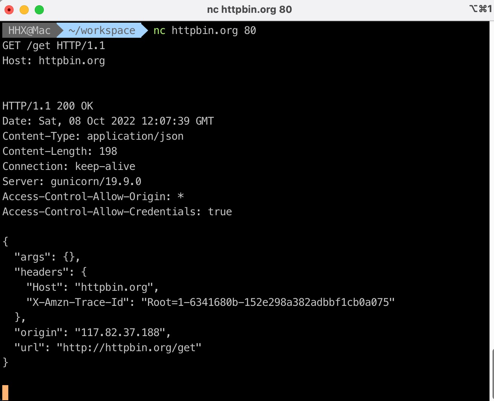

# nc/telnet

nc （netcat 的简称）以及 telnet 能够连接 TCP/UDP 端口号与其通信，也可用于端口连通性测试。
两个命令有可能需要通过手动安装。
HTTP 报文测试
一般而言，HTTP 默认监听的是 80 端口，我们可通过 nc 与网站的 80 端口直接通过 HTTP 报文进行通信。
输入 nc httpbin.org 80 命令后回车执行命令，随后手动输入 HTTP 请求报文，nc 将打印出响应报文。

```bash
$ nc httpbin.org 80
GET /get HTTP/1.1
Host: httpbin.org

HTTP/1.1 200 OK
Date: Wed, 21 Sep 2022 07:16:25 GMT
Content-Type: application/json
Content-Length: 200
Connection: keep-alive
Server: gunicorn/19.9.0
Access-Control-Allow-Origin: *
Access-Control-Allow-Credentials: true

{
  "args": {},
  "headers": {
    "Host": "httpbin.org"
  },
  "url": "http://httpbin.org/get"
}
```

通过 telnet 同样可以达到效果，不过一般建议使用 nc

```bash
$ telnet httpbin.org 80
Trying 18.207.88.57...
Connected to httpbin.org.
Escape character is '^]'.
GET /get HTTP/1.1
Host: httpbin.org

HTTP/1.1 200 OK
Date: Wed, 21 Sep 2022 07:22:36 GMT
Content-Type: application/json
Content-Length: 200
Connection: keep-alive
Server: gunicorn/19.9.0
Access-Control-Allow-Origin: *
Access-Control-Allow-Credentials: true

{
  "args": {},
  "headers": {
    "Host": "httpbin.org"
  },
  "url": "http://httpbin.org/get"
}
```

## 作业

1. 安装 nc/telnet 命令行工具
   > mac 自带
2. 通过 nc/telnet 使用 HTTP 报文与网站进行通信
   
