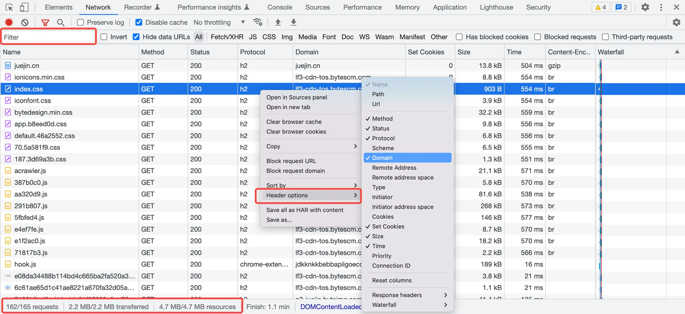
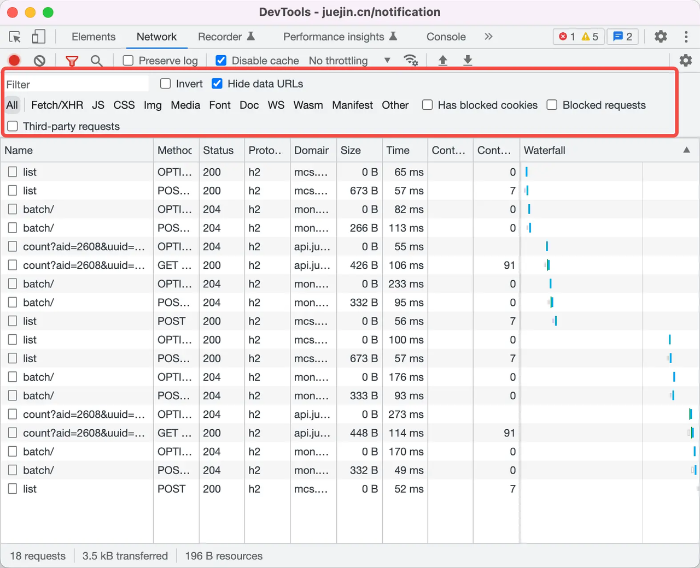
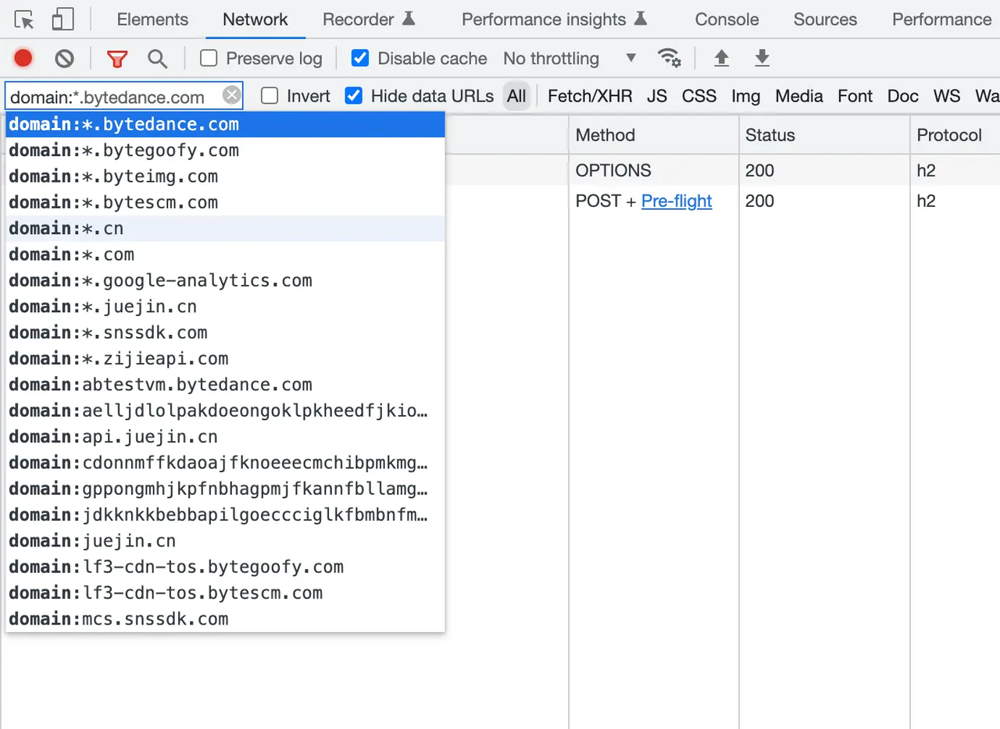
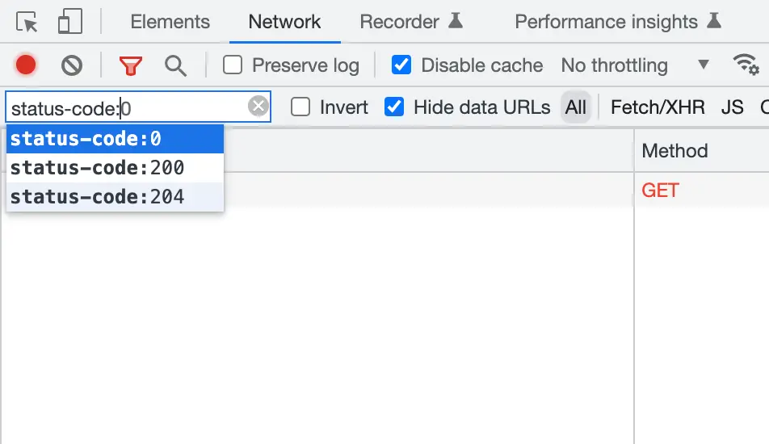
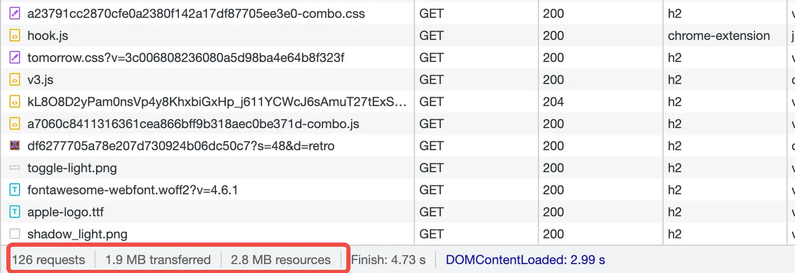
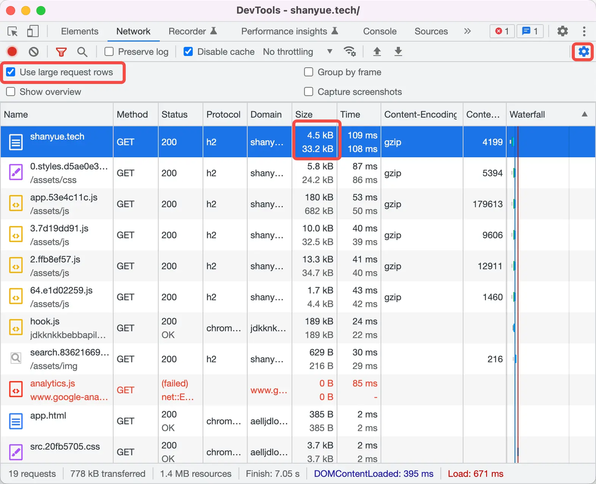

# Chrome Devtools

在 Chrome 浏览器中，可通过控制台中网络面板来查看 HTTP 报文信息。
打开 Chrome 浏览器，快捷键 `<Control-Shift-I>` 或者 `<Command-Shift-I>` 可打开控制台网络面板。
本篇文章讲解几个高频操作，如果想要更详细的讲解，可查看官方文档 Inspect network activity。

## Header Options

在网络面板中，右键，点击 Header Options，可网络面板中显示更多选项列。
建议添加以下选项

- Protocol：HTTP 协议版本号
- Content-Length：响应体大小
- Content-Encoding：响应体编码

## Filter

在筛选条的最左侧，有筛选文本输入框，可对资源进行筛选。

1. /[cj]s/，直接输入正则表达式对资源进行筛选
2. domain:`<domain>`，根据域名进行筛选
3. method：根据请求方法进行筛选
4. status-code：根据状态码进行筛选，另它会自动补充所有资源的状态码，可查看该网站资源有多少状态码
5. larger-than:`<size>`：筛选大于指定体积的资源，如 larger-than:100k
6. has-response-header:`<header>`，可对是否包含某响应头进行筛选，如 has-response-header:cache-control
7. mime-type：根据指定 MIME 类型进行筛选

## 底部状态栏

1. 打开网络面板控制台后，有 126 个请求
2. 打开网络面板控制台后，有 1.9MB 资源进行了传输，未压缩时体积 2.8MB，压缩后为 1.9MB

在控制台中，也可以通过以上配置显示每条资源压缩前和解压后的体积。

## 作业

1. 在开发环境调试 HTTP 请求时，如何只筛选出 localhost 上的所有请求

   > 使用：domain:localhost

2. 如何看出某个网站首页加载了多少个请求
   > 底部状态栏左下角
3. 如何在控制台中显示 HTTP 协议一列
   > 控制台网络 tab 里右键选 Header Options， 再勾选 Protocol
