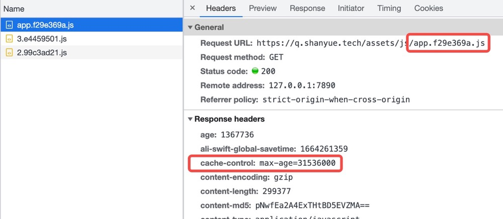

# 强缓存与协商缓存

HTTP 缓存分为以下两种，两者都是通过 HTTP 响应头控制缓存。

1. 强制缓存
2. 协商缓存

## 强制缓存

再次请求时无需再向服务器发送请求

```bash
          client         server
GET /a.ab389z.js ------->
                <------- 200 OK
(再也不会发请求)
```

与之相关的 Response Headers 有以下几个

- Expires

这个头部也是丧心病狂：使用绝对时间，且有固定的格式 <https://tools.ietf.org/html/rfc822#section-5.1>

```bash
Expires: Mon, 25 Oct 2021 20:11:12 GMT
```

- Cache-Control，具有强大的缓存控制能力

常用的有以下两个

- no-cache，每次请求需要校验服务器资源的新鲜度
- max-age=31536000，浏览器在一年内都不需要向服务器请求资源

以下是山月网站配置一年强缓存的示例，一般来说，文件名中带有 hash 字符串的文件都可以配置一年强缓存。



## 协商缓存

再次请求时，需要向服务器校验新鲜度，如果资源是新鲜的，返回 304，从浏览器获取资源

```bash
           client         server
GET /a.js   ----------->
                   <----------- 200 OK
GET /a.js   ----------->
                   <----------- 304 Not Modified
```

与之相关的 Request/Response Headers 有以下几个

- Last-Modified/If-Modified-Since，匹配 Response Header 的 Last-Modified 与 Request Header 的 If-Modified-Since 是否一致
- Etag/If-None-Match，匹配 Response Header 的 Etag 与 Request Header 的 If-None-Match 是否一致

## 作业

1. 什么是强缓存和协商缓存

   - 强缓存：再次请求时无需再向服务器发送请求
   - 协商缓存：再次请求时，需要向服务器校验新鲜度，如果资源是新鲜的，返回 304，从浏览器获取资源
     > 同时配置了强缓存和协商缓存时，如果未命中强缓存才会尝试协商缓存，命中协商缓存则依然读取缓存，否则向服务器请求，而没有配置强缓存时则自动配置启发式缓存

2. 如何验证网站某资源添加了强缓存

   Cache-Control 是否配置为 no-cache 或者 max-age=31536000

3. 协商缓存如何校验新鲜度

   两种方法：

   - 通过对比请求头的 If-Modified-Since 与响应头的 Last-Modified 是否一致
   - 通过对比请求头的 If-None-Match 与响应头的 Etag 是否一致
