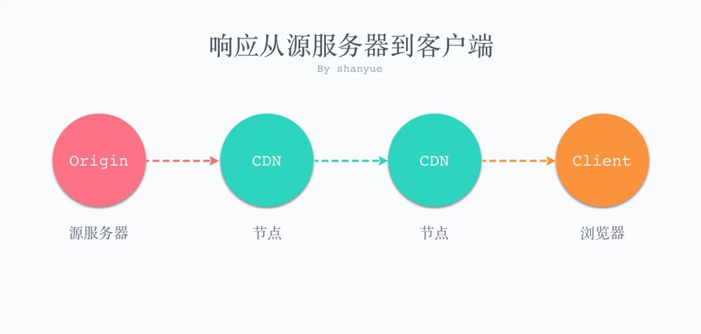
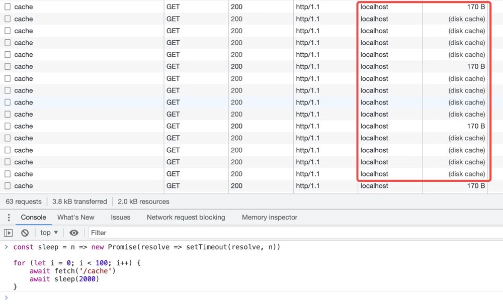

# 强缓存与 age/max-age



一条 HTTP 响应，从源服务器到客户端需要经过多个 Proxy，包括 Nginx 反向代理、CDN 等。

> 注意：一条 HTTP 响应报文会经历从源服务器到客户端，其中某些响应头由源服务器控制生成，而某些响应头由 CDN 控制生成。

而在这个过程中，在源服务器配置的某些请求头比如 Cache-Control，也将会在 CDN 生效。因此长期缓存的意义不仅仅在客户端，更在 CDN 上。
比如，某一条配置了一年长期强缓存的资源为 main.abcxyz.js

1. 身在太原的用户甲，访问该请求，由于该请求是第一次被太原的用户访问，该请求将从源服务器中获取，并缓存在太原的 CDN 节点一年时间。请求成功后，该请求在浏览器进行一年的强缓存，一年之内将可利用浏览器的缓存，不会对该资源发起实际请求
2. 身在太原的用户乙，访问该请求，由于身在同一城市的用户甲已访问过，直接从太原的 CDN 节点获取数据，将比直接通过源服务器请求数据拥有更快的速度。

如果 CDN 节点关于该请求的缓存到期，当用户发起请求时，CDN 节点将又会直接从源服务器获取资源，这个过程叫做回源。

## max-age/age

如果某条资源强缓存一年时间，在客户端向该资源发起请求时，该资源刚好还有一天时间到期，但是在客户端又接收到了 Cache-Control 强缓存一年的配置，那该资源岂不是被缓存了两年？
如果中间代理服务器有五个，该资源岂不是可以缓存五六年？
其实，这是不可能发生的情况。它与一个由代理服务器产生的响应头有关：

- age: HTTP 资源在代理服务器中的存储时间，以秒作为单位。由代理服务器产生，而非源服务器产生。

比如，当浏览器接收到以下响应报文时，该资源仅仅只会缓存 10 秒，而非 100 秒。

```bash
age: 90
cache-control: max-age=100
```

## 一个测试

通过 HTTP Server，配置以下响应头。代码见 http/index.js
服务器代码如下所示：

```js
{
  '/cache': () => {
    res.setHeader('cache-control', 'max-age=100')
    res.setHeader('age', '90')
    res.end('Cache 100s')
  }
}
```

浏览器代码如下所示，每两秒发送一次请求，并在控制台执行，并打开网络面板查看网络情况。

```js
const sleep = (n) => new Promise((resolve) => setTimeout(resolve, n))

for (let i = 0; i < 100; i++) {
  await fetch('/cache')
  await sleep(2000)
}
```

由于是每两秒发送一次请求，则预期每五次便会发送一次真正的请求，以下是测试结果，与预期一致。



## 作业

1. 使用 Node.js 写一段服务器代码测试 age/max-age

   

2. age/max-age 的作用是什么

   - age:当前服务器已缓存时间（秒）
   - max-age:最大缓存时间（秒）
