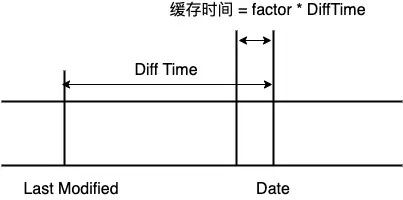

# 启发式缓存

当对某资源没有配置 Cache-Control 响应头时，客户端将会根据以下两个响应头**计算出合适的强缓存时间**，被称为启发式缓存。

- Date: HTTP 报文在源服务器的产生时间
- Last-Modified: 源服务器上资源的上次修改时间

还有一个相关参数，称为 LM-Factor 与它俩有关，它处于 [0, 1] 之间，以下使用 n 来替代。
简而言之，一个静态资源没有设置 Cache-Control 响应头时会以这两个响应头来设置**强制缓存时间**：(Date - LastModified) \* n，而**非直接进行协商缓存**。
在涉及到 CDN 时，表现更为明显，如果对 index.html 没有配置 Cache-Control 响应头时，体现在更新代码部署后，界面没有更新，这是一个非常严重的问题。

作业

1. 什么是启发式缓存

   当对某资源没有配置 Cache-Control 响应头时，客户端将会根据(Date - LastModified) \* n 来配置**强缓存**

2. 你们有过部署代码后页面无更新，且强制刷新不生效的案例吗

   无
