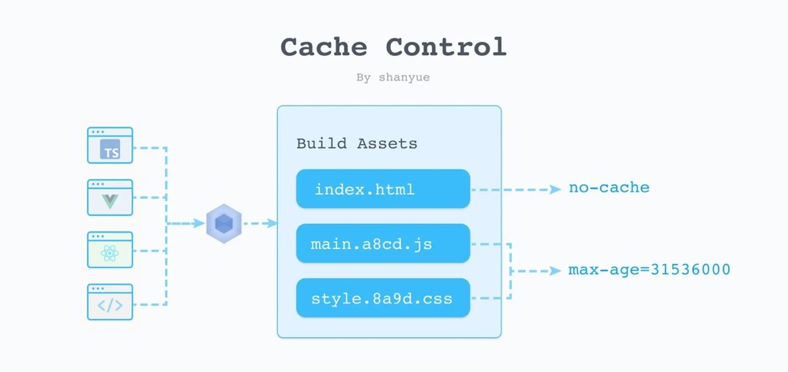

# 项目缓存策略

使用 webpack/rollup 等打包器进行打包时，每个资源都可生成一个带有 hash 的路径。如

- build/main.071b73.js
- build/main.94474e.css
- build/logo.18bac8.png

此处对添加 hash 的资源设置一年强缓存时间，可大幅度提高该网站的缓存能力，从而大幅度提高网站的二次加载性能。
通过在服务器端/网关端对资源设置以下 Response Header，进行强缓存一年时间，称为 Long Term Cache

```bash
Cache-Control: max-age=31536000
```

而当源文件内容发生变更时，资源的 hash 发生变化，生成新的可永久缓存的资源地址。

```js
// 第一次构建
'build/main.071b73.js'

// 源文件内容发生变更后，第二次构建
'build/main.8ba93c.js'
```

因此在实践中，可对打包处理后带有 hash 资源的所有文件设置永久缓存。
如果前端通过 docker/k8s/helm 进行部署，可由团队人员自行在构建 nginx 镜像时进行添加响应头字段。
而**对于 index.html 等不添加 hash 的资源，一定要显式地配置 Cache-Control: no-cache**，如果不配置该字段，则会触发启发式缓存，造成应用升级但刷新不生效的问题。



## 作业

1. 如何为项目中的资源配置缓存策略

   - 对于打包后有哈希值的资源可在服务端配置强缓存响应头：`Cache-Control: max-age=31536000`
   - 对于不添加哈希值值的资源需要配置不缓存响应头：`Control: no-cache`

2. 查看自己经常浏览的网站，查看其配置缓存策略，主要查看其 Cache-Control 字段

   html 文件响应头未配置

3. 如何可对带有 hash 的资源配置长期缓存
   服务端配置响应头`Cache-Control: max-age=31536000`
