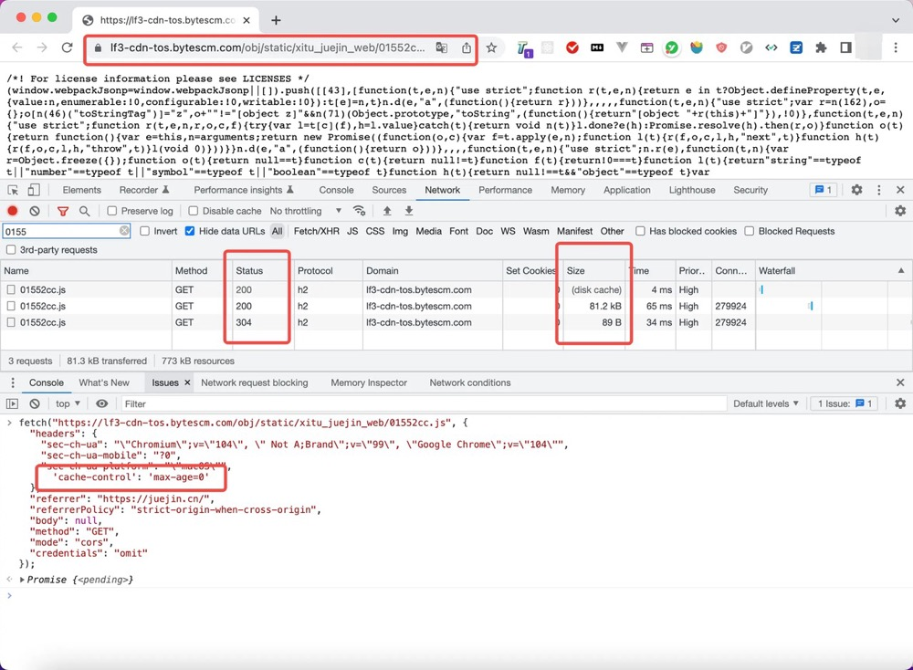
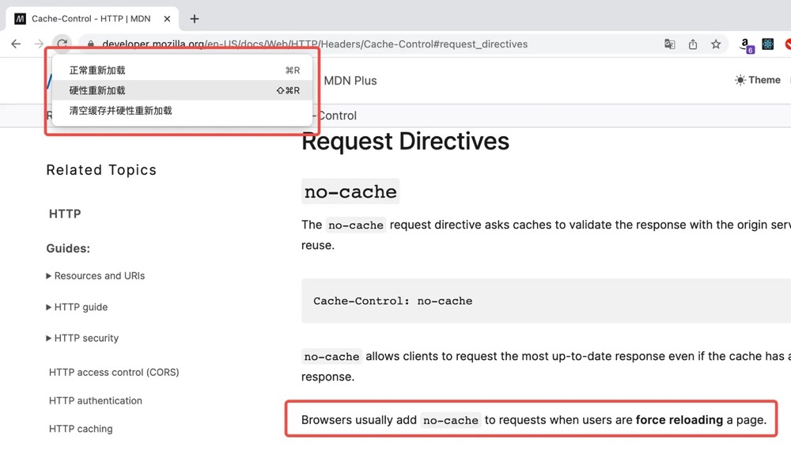

# Cache-Control 为请求头

Cache-Control 作为响应头，用以控制缓存策略，这也是前端 HTTP 缓存策略的基础。
但是你知道 Cache-Control 也可以作为请求头吗，以及它作为请求头有何作用？
以最常见的 no-cache 及 max-age=0 为例，**二者均会重新向服务器发起请求，哪怕该请求已被强缓存。**
可参考 MDN cache-control directives

## no-cache/max-age=0

- Cache-Control: no-cache 作为请求头，表示即便在客户端拥有未过期的缓存，也要向服务器请求获得最新的资源。
- Cache-Control: max-age=0 作为请求头，将会验证服务器资源的新鲜度，如果缓存未过期，则利用缓存，返回 304 状态码，否则重新获取资源返回 200 状态码。

为了进行验证，我们打开掘金的官网，在网络中找到任意一条强缓存的资源，进行测试。

> Q：怎么验证某条资源为强缓存资源？


缓存策略通过服务器进行配置，但是缓存资源在 HTTP 客户端进行实现，而 Apifox 等进行 HTTP 管理的 HTTP 客户端未实现缓存，因此在浏览器中使用控制台的网络面板进行测试。
为了方便以及避免跨域问题，我们直接在浏览器控制面板将请求 Copy as fetch 并在新标签页面打开该资源，随后打开浏览器控制台网络面板。
通过使用 fetch 发送请求，并通过 headers 控制请求头 cache-control，在控制台中进行测试，并在网络面板检测网络状况。

```js
fetch('https://lf3-cdn-tos.bytescm.com/obj/static/xitu_juejin_web/01552cc.js', {
  headers: {
    'sec-ch-ua': '"Chromium";v="104", " Not A;Brand";v="99", "Google Chrome";v="104"',
    'sec-ch-ua-mobile': '?0',
    'sec-ch-ua-platform': '"macOS"',
    // 分别修改为 max-age=0/no-cache，以及删除该字段来验证
    'cache-control': 'max-age=0',
  },
  referrer: 'https://juejin.cn/',
  referrerPolicy: 'strict-origin-when-cross-origin',
  body: null,
  method: 'GET',
  mode: 'cors',
  credentials: 'omit',
})
```

测试结果如下：



## 浏览器中关于缓存的控制

1. `<Ctrl-R>`：正常重新加载。实际上的实现是每次发送请求携带 Cache-Control: max-age=0 头部。
2. `<Shift-Ctrl-R>`：硬性重新加载。实际上的实现是每次发送请求携带 Cache-Control: no-cache 头部。



## 作业

1. cache-control: no-cache 作为请求头以及响应头时分别是什么意思

   - 请求头时：每次都要请求最新资源
   - 响应头时：控制缓存策略，每次请求都验证**新鲜度**
     > 注意：响应头时如果需要每次请求应该使用 no-store

2. cache-control: no-cache 与 cache-control: max-age=0 作为请求头有何区别

   - no-cache：每次都请求最新资源
   - max-age=0：每次都验证新鲜度

3. 浏览器中的正常重新加载与硬性重新加载，分别会如何发送请求

   - 正常重新加载：实际上的实现是每次发送请求携带 Cache-Control: max-age=0 头部
   - 硬性重新加载：实际上的实现是每次发送请求携带 Cache-Control: no-cache 头部
