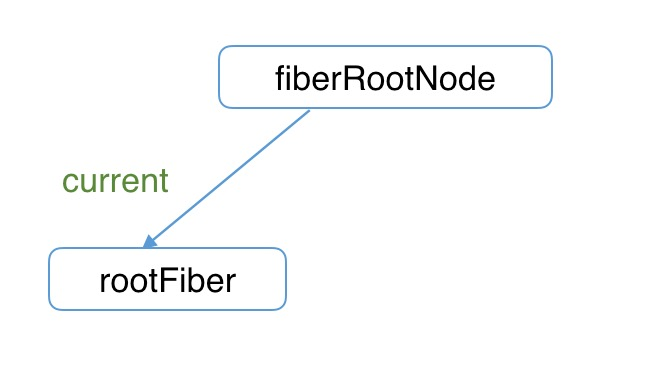
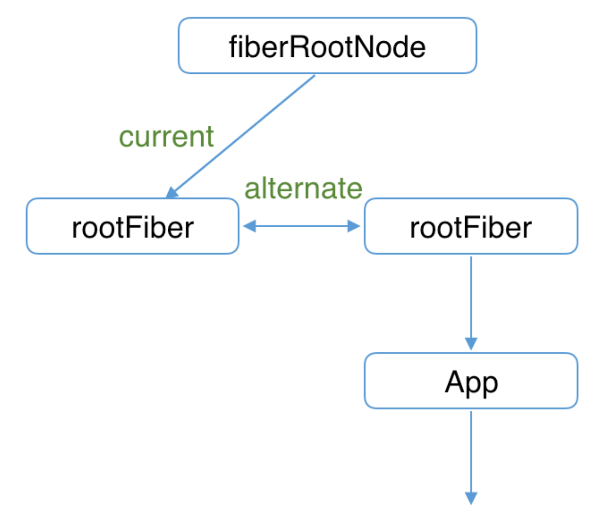
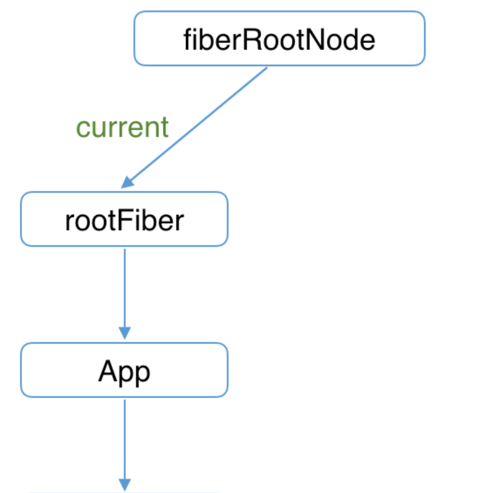
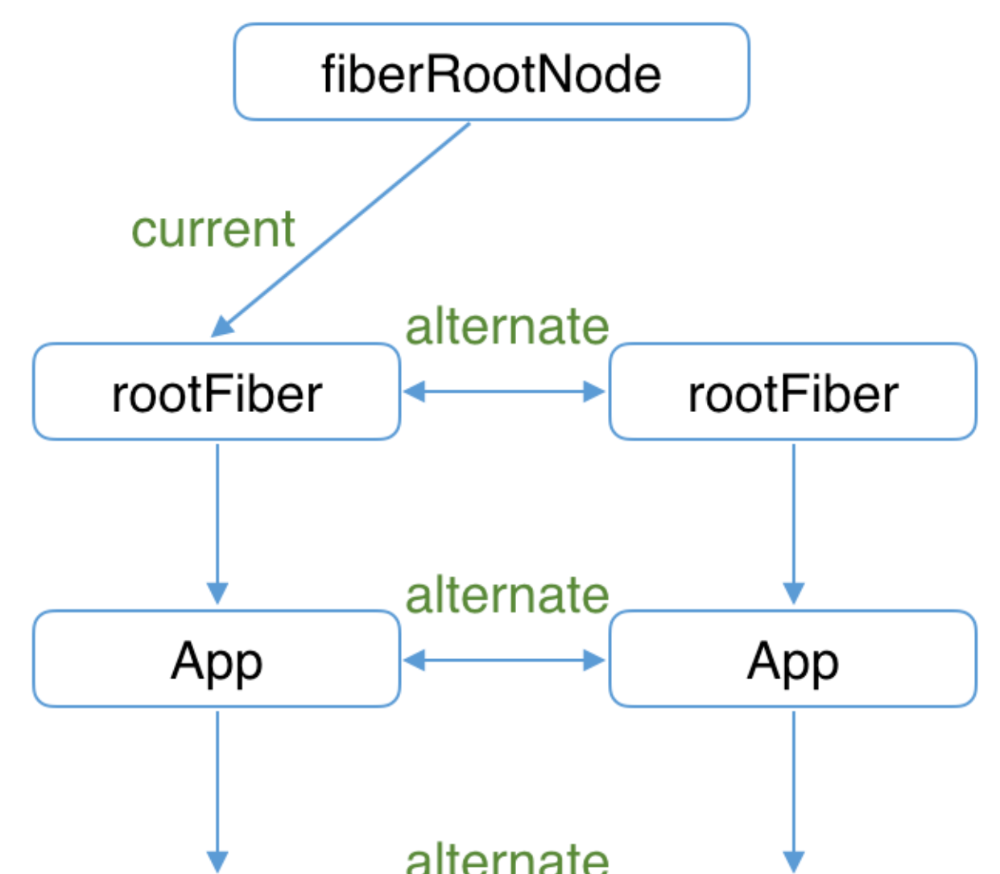

# fiber

## fiber 的含义

- 架构：React15 的 Reconciler 采用递归的方式执行，数据保存在递归调用栈中，所以被称为 Stack Reconciler。React16 的 Reconciler 基于 Fiber 节点实现，被称为 Fiber Reconciler
- 静态数据结构：每个 Fiber 节点对应一个 React Element，保存了该组件的类型（函数组件/类组件/原生组件...）、对应的 DOM 节点等信息
- 动态工作单元：每个 Fiber 节点保存了本次更新中该组件改变的状态、要执行的工作（需要被
  删除/被插入页面中/被更新...）

```js
function FiberNode(tag: WorkTag, pendingProps: mixed, key: null | string, mode: TypeOfMode) {
  // 作为静态数据结构的属性
  this.tag = tag
  this.key = key
  this.elementType = null
  this.type = null
  this.stateNode = null

  // 用于连接其他Fiber节点形成Fiber树
  this.return = null
  this.child = null
  this.sibling = null
  this.index = 0

  this.ref = null

  // 作为动态的工作单元的属性
  this.pendingProps = pendingProps
  this.memoizedProps = null
  this.updateQueue = null
  this.memoizedState = null
  this.dependencies = null

  this.mode = mode

  this.effectTag = NoEffect
  this.nextEffect = null

  this.firstEffect = null
  this.lastEffect = null

  // 调度优先级相关
  this.lanes = NoLanes
  this.childLanes = NoLanes

  // 指向该fiber在另一次更新时对应的fiber
  this.alternate = null
}
```

### 架构

```js
// 指向父级Fiber节点
this.return = null
// 指向子Fiber节点
this.child = null
// 指向右边第一个兄弟Fiber节点
this.sibling = null
```

### 静态数据结构

```js
// Fiber对应组件的类型 Function/Class/Host...
this.tag = tag
// key属性
this.key = key
// 大部分情况同type，某些情况不同，比如FunctionComponent使用React.memo包裹
this.elementType = null
// 对于 FunctionComponent，指函数本身，对于ClassComponent，指class，对于HostComponent，指DOM节点tagName
this.type = null
// Fiber对应的真实DOM节点
this.stateNode = null
```

### 动态工作单元

```js
// 保存本次更新造成的状态改变相关信息
this.pendingProps = pendingProps
this.memoizedProps = null
this.updateQueue = null
this.memoizedState = null
this.dependencies = null

this.mode = mode

// 保存本次更新会造成的DOM操作
this.effectTag = NoEffect
this.nextEffect = null

this.firstEffect = null
this.lastEffect = null

// 调度优先级相关
this.lanes = NoLanes
this.childLanes = NoLanes
```

## 双缓存

当前屏幕上显示内容对应的 Fiber 树称为 current Fiber 树，正在内存中构建的 Fiber 树称为 workInProgress Fiber 树。

current Fiber 树中的 Fiber 节点被称为 current fiber，workInProgress Fiber 树中的 Fiber 节点被称为 workInProgress fiber，他们通过 alternate 属性连接。

React 应用的根节点通过使 current 指针在不同 Fiber 树的 rootFiber 间切换来完成 current Fiber 树指向的切换。

### mount

```js
const root = document.getElementById('root')
ReactDOM.render(<App />, root)
```


1. 首次执行 ReactDOM.render 会创建 fiberRootNode（源码中叫 **fiberRoot**，避免混淆大写为 FiberRoot）和 rootFiber。

   其后可以多次执行 ReactDOM.render 进行 rootFiber 的挂载

   **其中 fiberRootNode 是整个应用的根节点，rootFiber 是`<App/>`所在组件树的根节点 id 为 root 的 div。**

   fiberRootNode 的 current 会指向当前页面上已渲染内容对应 Fiber 树，即 current Fiber 树。

   

   ```js
   fiberRootNode.current = rootFiber
   ```

2. 接下来进入 render()阶段，根据组件返回的 JSX 在内存中依次创建 Fiber 节点并连接在一起构建 Fiber 树，被称为 workInProgress Fiber 树

   在构建 workInProgress Fiber 树时会尝试复用 current Fiber 树中已有的 Fiber 节点内的属性，**在首屏渲染时只有 rootFiber 存在对应的 current fiber**（即 rootFiber.alternate）。

   

3. 图中右侧已构建完的 workInProgress Fiber 树在 commit()阶段渲染到页面。
   此时 DOM 更新为右侧树对应的样子。

   fiberRootNode 的 current 指针指向 workInProgress Fiber 树使其变为 current Fiber 树。
   

### update

1. 接下来我们点击 p 节点触发状态改变，这会开启一次新的 render 阶段并构建一棵新的 workInProgress Fiber 树。
   
   和 mount 时一样，workInProgress fiber 的创建可以复用 current Fiber 树对应的节点数据,复用的依据就是 **Diff 算法**。

2. workInProgress Fiber 树在 render 阶段完成构建后进入 commit 阶段渲染到页面上。渲染完毕后，workInProgress Fiber 树变为 current Fiber 树。
