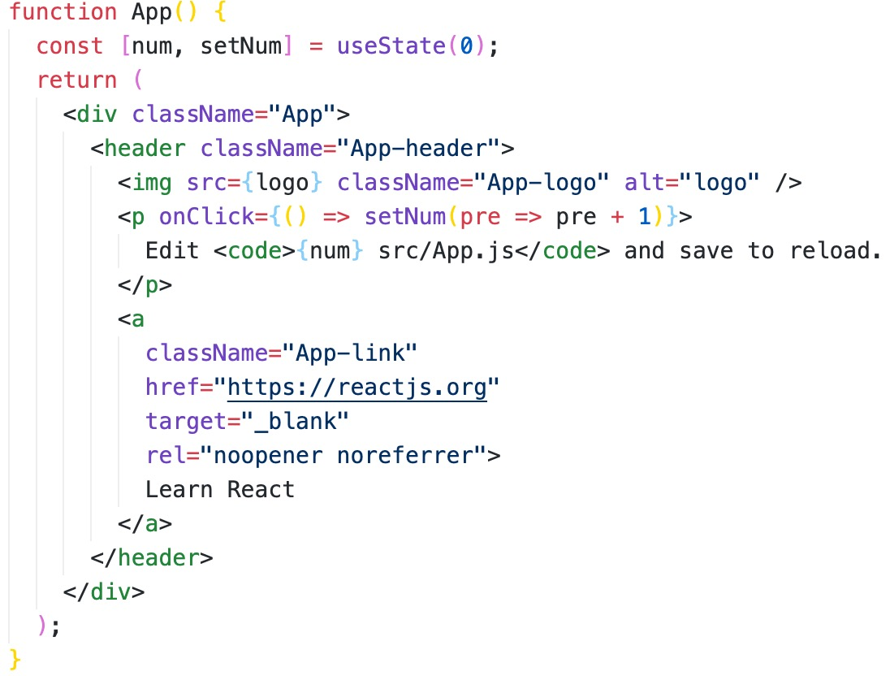

# 流程



> 标签<...>调用 beginWork 标签</...>调用 completeWork

```js
// 调用beginWork找子节点
div:root beginWork
App() beginWork
div beginWork
header beginWork

img beginWork
// 无子节点调用completeWork找兄弟节点，兄弟节点为p
img completeWork

// 调用beginWork找子节点
p beginWork

'Edit' beginWork
// 无子节点调用completeWork找兄弟节点，兄弟节点为code
'Edit' completeWork

code beginWork

{num} beginWork
{num} completeWork

'src/App.js' beginWork
'src/App.js' completeWork

code completeWork

'and save to reload.' beginWork
'and save to reload.' completeWork

p completeWork

a beginWork
a completeWork

header completeWork
div completeWork
App() completeWork
div:root completeWork
```

render 阶段开始于 performSyncWorkOnRoot 或 performConcurrentWorkOnRoot 方法的调用。这取决于本次更新是同步更新还是异步更新。

```js
// performSyncWorkOnRoot会调用该方法
function workLoopSync() {
  while (workInProgress !== null) {
    performUnitOfWork(workInProgress)
  }
}

// performConcurrentWorkOnRoot会调用该方法
function workLoopConcurrent() {
  while (workInProgress !== null && !shouldYield()) {
    performUnitOfWork(workInProgress)
  }
}
```

可以看到，他们唯一的区别是是否调用 shouldYield。如果当前浏览器帧没有剩余时间，shouldYield 会中止循环，直到浏览器有空闲时间后再继续遍历。

workInProgress 代表当前已创建的 workInProgress fiber。

performUnitOfWork 方法会调用 beginWork 和 completeWork

```js
function performUnitOfWork(fiber) {
  // 执行beginWork

  if (fiber.child) {
    performUnitOfWork(fiber.child)
  }

  // 执行completeWork

  if (fiber.sibling) {
    performUnitOfWork(fiber.sibling)
  }
}
```

## 递

首先从 rootFiber 开始向下深度优先遍历。为遍历到的每个 Fiber 节点调用 beginWork 方法 (opens new window)。

该方法会根据传入的 Fiber 节点创建子 Fiber 节点，并将这两个 Fiber 节点连接起来。

当遍历到叶子节点（即没有子组件的组件）时就会进入“归”阶段。

## 归

在“归”阶段会调用 completeWork (opens new window)处理 Fiber 节点。

当某个 Fiber 节点执行完 completeWork，如果其存在兄弟 Fiber 节点（即 fiber.sibling !== null），会进入其兄弟 Fiber 的“递”阶段。

如果不存在兄弟 Fiber，会进入父级 Fiber 的“归”阶段。

“递”和“归”阶段会交错执行直到“归”到 rootFiber。至此，render 阶段的工作就结束了。
