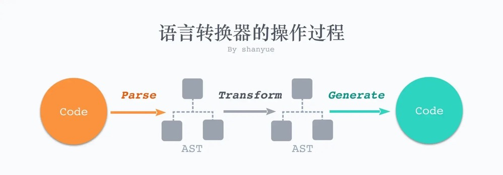
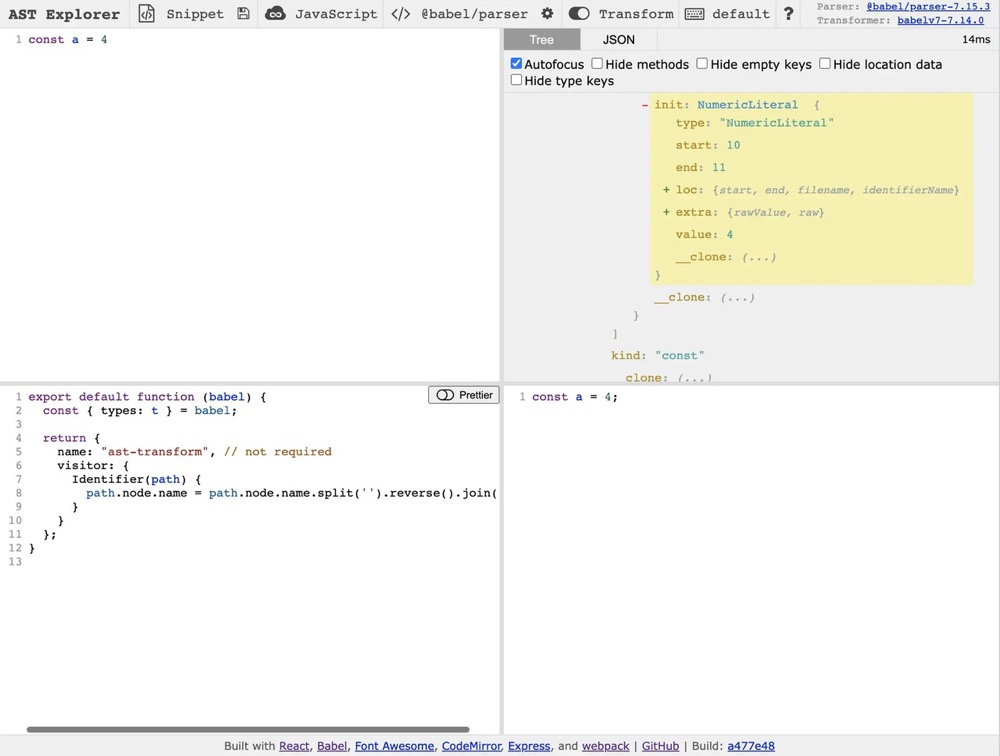
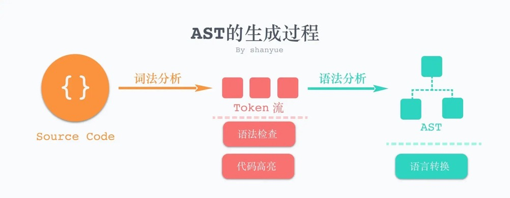
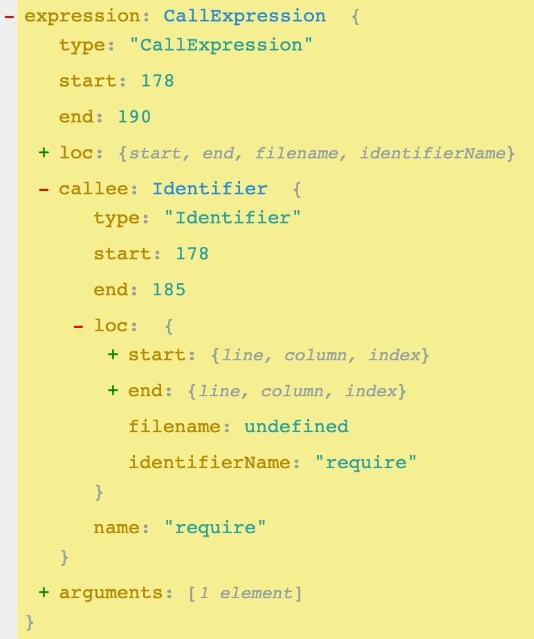

# cjs 模块收集与 ast

AST，Abstract Syntax Tree，即抽象语法树，是前端工程化绕不过的一个名词，也是面试高频问题，如果你对它还不了解，那可得注意了。
AST 涉及到工程化诸多环节的应用，比如:

1. 如何将 Typescript 转化为 Javascript (typescript)
2. 如何将 SASS/LESS 转化为 CSS (sass/less)
3. 如何将 ES6+ 转化为 ES5 (babel)
4. 如何将 Javascript 代码进行格式化 (eslint/prettier)
5. 如何识别 React 项目中的 JSX (babel)
6. GraphQL、MDX、Vue SFC 等等
   而在语言转换的过程中，实质上就是对其 AST 的操作，核心步骤就是 AST 三步走
7. Code -> AST (Parse)
8. AST -> AST (Transform)
9. AST -> Code (Generate)



以下是一段代码，及其对应的 AST

```js
// Code
const a = 4

// AST
{
  "type": "Program",
  "start": 0,
  "end": 11,
  "body": [
    {
      "type": "VariableDeclaration",
      "start": 0,
      "end": 11,
      "declarations": [
        {
          "type": "VariableDeclarator",
          "start": 6,
          "end": 11,
          "id": {
            "type": "Identifier",
            "start": 6,
            "end": 7,
            "name": "a"
          },
          "init": {
            "type": "Literal",
            "start": 10,
            "end": 11,
            "value": 4,
            "raw": "4"
          }
        }
      ],
      "kind": "const"
    }
  ],
  "sourceType": "module"
}
```

不同的语言拥有不同的解析器，比如 Javascript 的解析器和 CSS 的解析器就完全不同。
对相同的语言，也存在诸多的解析器，也就会生成多种 AST，如 babel 与 espree。可重点注意以下几种解析器：

1. babel
2. espree：应用在 ESLint
3. acorn：应用在 Node.js、Webpack、Rollup
4. swc：使用 Rust 编写，性能超强
   在 [AST Explorer](https://astexplorer.net/) 中，列举了诸多语言的解析器(Parser)，及转化器(Transformer)。



## AST 的生成

AST 的生成这一步骤被称为解析(Parser)，而该步骤也有两个阶段: 词法分析(Lexical Analysis)和语法分析(Syntactic Analysis)

## 词法分析 (Lexical Analysis)

词法分析用以将代码转化为 Token 流，维护一个关于 Token 的数组


```js
// Code
a = 3

// Token
[
  { type: { ... }, value: "a", start: 0, end: 1, loc: { ... } },
  { type: { ... }, value: "=", start: 2, end: 3, loc: { ... } },
  { type: { ... }, value: "3", start: 4, end: 5, loc: { ... } },
  ...
]
```

词法分析后的 Token 流也有诸多应用，如:

1. 代码检查，如 eslint 判断是否以分号结尾，判断末尾是否含有分号的 token
2. 语法高亮，如 highlight/prism 使之代码高亮
3. 模板语法，如 ejs 等模板也离不开

## 语法分析 (Syntactic Analysis)

语法分析将 Token 流转化为结构化的 AST，方便操作

```js
{
  "type": "Program",
  "start": 0,
  "end": 5,
  "body": [
    {
      "type": "ExpressionStatement",
      "start": 0,
      "end": 5,
      "expression": {
        "type": "AssignmentExpression",
        "start": 0,
        "end": 5,
        "operator": "=",
        "left": {
          "type": "Identifier",
          "start": 0,
          "end": 1,
          "name": "a"
        },
        "right": {
          "type": "Literal",
          "start": 4,
          "end": 5,
          "value": 3,
          "raw": "3"
        }
      }
    }
  ],
  "sourceType": "module"
}
```

## `__webpack_modules__` 的构建

既然已经了解了 AST 是什么，那我们就可以基于 AST 构建出 `__webpack_modules__`。
我们通过 AST，找到所有的 require 函数，便可确认模块的依赖关系，由于 JS 执行查找模块为深度优先搜索遍历，根据模块依赖对所有模块构造一个以深度优先的树。
如果模块依赖关系如下：

```js
// index.js
const sum = require('./sum')
const hello = require('./hello')

// sum.js
const math = require('./math')
```

则通过 AST 可以构建出以下的`__webpack_modules__` 数组。

- index.js -> 0
  - sum.js -> 1
    - math.js -> 2
  - hello.js -> 3
    当我们在社区看到一篇文章：实现一个小型的 webpack 打包器，一般是通过 AST 解析配合模板生成类似于 webpack 的运行时代码，而其中最重要的一步便是构建出所有的依赖模块数组，及 `__webpack_modules__`。

> 我也实现了一个 mini-webpack，并且包含完整的注释。其中，关于运行时的模板直接照抄 webpack 即可，而最主要的工作量就是：

1. 构建模块依赖树，构建过程中需要将 require(name) 转化为 require(moduleId)，此过程通过 babel 的 parser/generate 函数完成。
2. 将模块依赖树转化为模块数组
3. 将模块数组的每一个模块通过 module wrapper 包裹
4. 生成模板

## 作业

1. 了解 AST 概念

   1. 通过解析 parser 生成 AST
   2. code(词法分析)=>Token(语法分析)=>AST
   3. Token 可以进行代码检查，语法高亮等

2. 在 AST Explore 尝试 Javascript/CSS 解析，并观察其语法树

   
   如图是 require 的语法树，4.会用到

3. 如何根据入口文件搜索出所有需要打包的模块

   code 解析成 AST 后，以入口文件作为根节点开始深度优先遍历，通过 AST 找到具有 require 函数的节点,构建**webpack_modules** 数组

4. 如何模拟实现运行时代码的生成，实现 mini-webpack

   见[Xwebpack](https://github.com/903040380/Xwebpack/tree/master/mywebpack)

5. 如何去除代码中的所有 console.log

   见[移除 console.log 的 Loader](https://github.com/903040380/Xwebpack/blob/master/loader/removeLogLoader.js)
