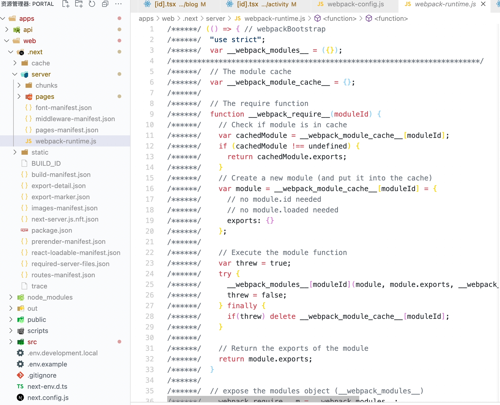
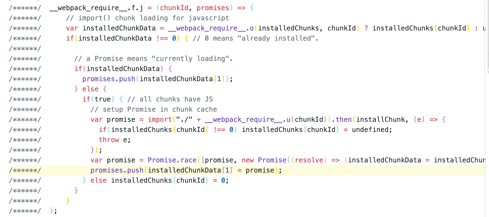
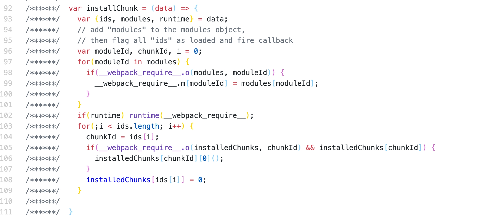

# code spliting 运行时分析

在项目性能优化时，常讲到 code spliting 代码分割用以分包。通过 import() 动态导入即可实现该功能。

```js
// index.js 内容
import('./sum').then((m) => {
  console.log(m.default(3, 4))
})

// sum.js 内容
const sum = (...args) => args.reduce((x, y) => x + y, 0)

export default sum
```

## code spliting

通过编写 webpack 配置文件，进行代码分割试验。源码见 [node-examples:code-spliting](https://github.com/shfshanyue/node-examples/tree/master/engineering/webpack/code-spliting) 的 f1 函数。

```js
webpack({
  entry: './index.js',
  mode: 'none',
  output: {
    filename: 'main.[id].[contenthash].js',
    chunkFilename: '[name].[id].chunk.[contenthash].js',
    path: path.resolve(__dirname, 'dist/contenthash'),
  },
})
```

打包结果如下所示：

```bash
$ ls -lh dist/contenthash
total 32
-rw-r--r--  1 xiange  staff   523B Aug 10 22:42 1.1.chunk.f64a38ddcbde85380cf2.js
-rw-r--r--  1 xiange  staff    11K Aug 10 22:42 main.0.b24842085bcbb88b0d94.js
```

此时的 main.js，即 main.0.b24842085bcbb88b0d94.js，占用 11K 字节，代码总量 261 行。体积直接比 CommonJS 与 ESM 示例的代码量上了一个级别。而它们做了相同的事情，进行求和。

> 还记得 CommonJS 与 ESM 示例中，他们的运行时代码有多少行？

## 调试

在前序章节，因为打包后脚本与 DOM 关系不大，因此可以很方便地通过 node.js 环境在 vscode 中进行调试。
而在代码分割该章节，由于涉及到了 chunk 的异步加载，需要通过 JSONP 进行脚本加载，因此需要在浏览器环境中进行调试。
此时，可添加 index.html，使其引入打包后的 main.xxx.js，即可调试。源码见 node-examples:code-spliting/index.html。
接着，通过 serve 可开启静态资源服务，在浏览器中打开该服务，可进行调试。

```bash
# 启动静态资源，随后在浏览器中打开地址进行调试
$ npx serve .
```

## 前情提要

一个 webpack 的运行时，包括最重要的两个数据结构：

1. `__webpack_modules__`: 维护一个所有模块的数组。将入口模块解析为 AST，根据 AST 深度优先搜索所有的模块，并构建出这个模块数组。每个模块都由一个包裹函数 `(module, module.exports, __webpack_require__)` 对模块进行包裹构成。
2. `__webpack_require__(moduleId)`: 手动实现加载一个模块。对已加载过的模块进行缓存，对未加载过的模块，根据 id 定位到 `__webpack_modules__` 中的包裹函数，执行并返回 module.exports，并缓存。

## chunk 代码分析

通过观察打包后的文件 main.xxxxxx.js 最后几行代码，可以发现: 使用 import() 加载数据时，以上代码将被 webpack 编译为以下代码

```js
// 编译前代码
import('./sum').then(m => {
  console.log(m.default(3, 4))
})

// 被 webpack 编译后的代码
__webpack_require__.e(/* import() */ 1).then(__webpack_require__.bind(__webpack_require__, 1)).then(m => {
  console.log(m.default(3, 4))
}))
```

此时 `__webpack_require__.e(1)` 中的 1 为 chunkId，观察 1.1.chunk.xxxx.js 文件，以下为 sum 函数所构建而成的 chunk 代码。
我为其添加中文注释，方便理解

```js
'use strict'

// 1. JSONP cllaback，收集 modules 至 __webpack_modules__
// 2. 代码实现参考本章最后部分源码解析
;(self['webpackChunk'] = self['webpackChunk'] || []).push([
  [1],
  // 1. 该 chunk 中的所有 modules，从下边可以看出也是全部由包裹函数构成
  // 2. 该 modules 的 index 为 moduleId，从以下代码可以看到 moduleId=0 为空白
  // 3. 如果该 chunk 中包含的模块的 moduleId 过大，则使用对象表示，key 为 moduleId
  [
    ,
    (__unused_webpack_module, __webpack_exports__, __webpack_require__) => {
      __webpack_require__.r(__webpack_exports__)
      __webpack_require__.d(__webpack_exports__, {
        default: () => __WEBPACK_DEFAULT_EXPORT__,
      })

      const sum = (...args) => args.reduce((x, y) => x + y, 0)
    },
  ],
])
```

1. `__webpack_require__.e(moduleId)`: 加载 chunk。该函数将使用 `document.createElement('script')` 异步加载 chunk 并封装为 Promise。
2. `self["webpackChunk"].push`: JSONP Callback，收集 modules 至 `__webpack_modules__`，并将 `__webpack_require__.e` 的 Promise 进行 resolve。该函数名 `webpackChunk` 可通过 `output.chunkLoadingGlobal` 进行自定义。

```js
{
  output: {
    // 比如，可以改成脚手架的名称
    chunkLoadingGlobal: 'shanyueCB'
  }
}
```

**实际上，在 webpack 中可配置 `output.chunkLoading` 来选择加载 chunk 的方式，比如选择通过 import()/esm 的方式进行加载。**
由于在生产环境需要考虑 import 的兼容性，目前还是 JSONP 方式较多。

```js
{
  entry: './index.js',
  mode: 'none',
  output: {
    filename: 'main.[contenthash].js',
    chunkFilename: '[name].chunk.[chunkhash].js',
    path: path.resolve(__dirname, 'dist/import'),
    clean: true,
    // 默认为 `jsonp`
    chunkLoading: 'import',
    // 默认为 `array-push`
    chunkFormat: 'module'
  }
})
```

可参考示例 webpack 运行时代码 中查看加载一个 chunk 的实现。

## 运行时分析

分析 main.js 的运行时代码，即分析 entry chunk 的运行时代码

```js
// expose the modules object (__webpack_modules__)
// 为 __webpack_modules__ 重命名
__webpack_require__.m = __webpack_modules__

__webpack_require__.f = {}

// This file contains only the entry chunk.
// The chunk loading function for additional chunks
// 用以加载 code spliting 的 chunk
__webpack_require__.e = (chunkId) => {
  return Promise.all(
    Object.keys(__webpack_require__.f).reduce((promises, key) => {
      // 实际上是 __webpack_require__.f.j
      __webpack_require__.f[key](chunkId, promises)
      return promises
    }, [])
  )
}

/* webpack/runtime/get javascript chunk filename */
// This function allow to reference async chunks
// 得到 chunk 地址，用以加载
__webpack_require__.u = (chunkId) => {
  // return url for filenames based on template
  // 记住，这里的 chunk 脚本的地址被写死，意味着每当 chunk 的文件名发生改变，运行时代码也会发生改变
  // 记住，这里的 chunk 脚本的地址被写死，意味着每当 chunk 的文件名发生改变，运行时代码也会发生改变
  // 记住，这里的 chunk 脚本的地址被写死，意味着每当 chunk 的文件名发生改变，运行时代码也会发生改变
  return '' + chunkId + '.' + chunkId + '.chunk.' + 'f64a38ddcbde85380cf2' + '.js'
}

/* webpack/runtime/global */
// 封装全局变量
__webpack_require__.g = (function () {
  if (typeof globalThis === 'object') return globalThis
  try {
    return this || new Function('return this')()
  } catch (e) {
    if (typeof window === 'object') return window
  }
})()
```

以下是 webpack 实现加载 chunk 的 加载脚本。

```js
;(() => {
  var inProgress = {}
  // data-webpack is not used as build has no uniqueName
  // loadScript function to load a script via script tag
  __webpack_require__.l = (url, done, key, chunkId) => {
    // done 为脚本加载完时的回调函数
    if (inProgress[url]) {
      inProgress[url].push(done)
      return
    }

    // script：script 标签，用以加载 chunk，如 <script src="xxx.chunk.js">
    var script, needAttach
    if (key !== undefined) {
      // 判断该 script 标签是否已存在在 document 中
      var scripts = document.getElementsByTagName('script')
      for (var i = 0; i < scripts.length; i++) {
        var s = scripts[i]
        if (s.getAttribute('src') == url) {
          script = s
          break
        }
      }
    }

    // 如果 script 标签不存在在 document 中，则新建 script 标签，加载脚本
    if (!script) {
      needAttach = true
      script = document.createElement('script')

      script.charset = 'utf-8'
      script.timeout = 120

      // nonce，用以配置 CSP 策略，见 https://developer.mozilla.org/en-US/docs/Web/HTTP/CSP
      if (__webpack_require__.nc) {
        script.setAttribute('nonce', __webpack_require__.nc)
      }

      script.src = url
    }
    inProgress[url] = [done]
    var onScriptComplete = (prev, event) => {
      // avoid mem leaks in IE.
      script.onerror = script.onload = null
      clearTimeout(timeout)
      var doneFns = inProgress[url]
      delete inProgress[url]
      script.parentNode && script.parentNode.removeChild(script)

      // 脚本加载结束后，回调 done 函数，并传递 event 参数s
      doneFns && doneFns.forEach((fn) => fn(event))

      if (prev) return prev(event)
    }
    var timeout = setTimeout(onScriptComplete.bind(null, undefined, { type: 'timeout', target: script }), 120000)

    // script.onload 事件，脚本加载完成时，执行 onScriptComplete(script.onerror)
    // 可理解为以下两种形式：
    // script.onerror = e => { return onScriptComplete.bind(null, script.onerror)(e) }
    // script.onerror = e => { return onScriptComplete(script.onerror, e) }
    script.onerror = onScriptComplete.bind(null, script.onerror)

    // script.onload 事件，脚本加载完成时，执行 onScriptComplete(script.onload)
    script.onload = onScriptComplete.bind(null, script.onload)

    // 1. 将 script 附在 DOM 中，加载脚本
    // 2. chunk 脚本加载后执行 chunk 脚本中的 self["webpackChunk"].push 函数，即下边的 webpackJsonpCallback 函数
    needAttach && document.head.appendChild(script)
  }
})()
```

以下是 `__webpack_require__.f.j` 的实现，维护已加载的 chunk

```jd
(() => {
    // key 为 chunkId，value 为加载状态，其中加载状态
    // 0: 代表 chunk 加载成功
    // [resolve, reject, Promise]: 代表 chunk 正在加载
    // undefined: 代表 chunk 尚未加载
    // null: chunk 为 preloaded/refetched
    //
    // object to store loaded and loading chunks
    // undefined = chunk not loaded, null = chunk preloaded/prefetched
    // [resolve, reject, Promise] = chunk loading, 0 = chunk loaded
    var installedChunks = {
        0: 0
    };

    __webpack_require__.f.j = (chunkId, promises) => {
            // JSONP chunk loading for javascript
            var installedChunkData = __webpack_require__.o(installedChunks, chunkId) ? installedChunks[chunkId] : undefined;

            // 如果没有加载该 chunk，则加载该 chunk
            if(installedChunkData !== 0) { // 0 means "already installed".

                // a Promise means "currently loading".
                if(installedChunkData) {
                    // 如果 chunk 正在加载
                    promises.push(installedChunkData[2]);
                } else {
                    if(true) { // all chunks have JS
                        // setup Promise in chunk cache
                        // 赋值 installedChunkData 为 [resolve, reject, promise]
                        var promise = new Promise((resolve, reject) => (installedChunkData = installedChunks[chunkId] = [resolve, reject]));
                        promises.push(installedChunkData[2] = promise);

                        // 获取 chunk 的脚本地址
                        var url = __webpack_require__.p + __webpack_require__.u(chunkId);
                        // create error before stack unwound to get useful stacktrace later
                        var error = new Error();

                        var loadingEnded = (event) => {
                            if(__webpack_require__.o(installedChunks, chunkId)) {
                                installedChunkData = installedChunks[chunkId];
                                if(installedChunkData !== 0) installedChunks[chunkId] = undefined;
                                if(installedChunkData) {
                                    var errorType = event && (event.type === 'load' ? 'missing' : event.type);
                                    var realSrc = event && event.target && event.target.src;
                                    error.message = 'Loading chunk ' + chunkId + ' failed.\n(' + errorType + ': ' + realSrc + ')';
                                    error.name = 'ChunkLoadError';
                                    error.type = errorType;
                                    error.request = realSrc;
                                    installedChunkData[1](error);
                                }
                            }
                        };
                        __webpack_require__.l(url, loadingEnded, "chunk-" + chunkId, chunkId);
                    } else installedChunks[chunkId] = 0;
                }
            }
    };

    // no prefetching

    // no preloaded

    // no HMR

    // no HMR manifest

    // no on chunks loaded

    // install a JSONP callback for chunk loading
    // 即执行 chunk 脚本中的 JSONP Callback 函数
    var webpackJsonpCallback = (parentChunkLoadingFunction, data) => {
        //
        var [chunkIds, moreModules, runtime] = data;
        // add "moreModules" to the modules object,
        // then flag all "chunkIds" as loaded and fire callback
        var moduleId, chunkId, i = 0;
        if(chunkIds.some((id) => (installedChunks[id] !== 0))) {
            // 将该 chunk 中的 modules，全部添加到 __webpack_require__.m
            for(moduleId in moreModules) {
                if(__webpack_require__.o(moreModules, moduleId)) {
                    __webpack_require__.m[moduleId] = moreModules[moduleId];
                }
            }
            if(runtime) var result = runtime(__webpack_require__);
        }
        if(parentChunkLoadingFunction) parentChunkLoadingFunction(data);

        for(;i < chunkIds.length; i++) {
            chunkId = chunkIds[i];
            if(__webpack_require__.o(installedChunks, chunkId) && installedChunks[chunkId]) {
                // 加载成功，回调 resolve()，Promise 被 resolve 掉，成功回调
                // 加载成功，回调 resolve()，Promise 被 resolve 掉，成功回调
                // 加载成功，回调 resolve()，Promise 被 resolve 掉，成功回调
                installedChunks[chunkId][0]();
            }
            installedChunks[chunkId] = 0;
        }

    }

    var chunkLoadingGlobal = self["webpackChunk"] = self["webpackChunk"] || [];
    chunkLoadingGlobal.forEach(webpackJsonpCallback.bind(null, 0));
    chunkLoadingGlobal.push = webpackJsonpCallback.bind(null, chunkLoadingGlobal.push.bind(chunkLoadingGlobal));
})();
```

可总结，当设计到 code spliting 后，便有以下变量：

> 更多变量可查看 webpack 源码 lib/RuntimeGlobals

1. `__webpack_require__.m`：维护所有模块的数组
2. `__webpack_require__.g`：全局变量，一般为 globalThis
3. `__webpack_require__.p`：publicPath
4. `__webpack_require__.u`：获取某个 chunk 的脚本路径，注意，这里的 chunk 脚本的地址被写死，意味着每当 chunk 的文件名发生改变，运行时代码也会发生改变，这将破坏缓存！
5. `__webpack_require__.e`：加载某个 chunk
6. `__webpack_require__.f`：加载某个 chunk，并维护其 promises 的对象
7. `__webpack_require__.l`：加载某个 chunk 的脚本，加载成功后进行 JSONP Callback
8. `__webpack_require__.nc`：script 脚本的 nonce 属性，用以配置 scp

## 作业

1. 对 code spliting 后的代码进行调试与理解

   见[代码中的注释](https://github.com/903040380/Xwebpack/tree/master/code-spliting/example/jsonp)

2. 将自己项目取消代码压缩进行打包，观察其打包后的代码骨架
   

3. 在 webpack 中如何实现 code spliting

   import() 动态导入

4. 在 webpack 中，加载 chunk 脚本的 JSONP Callback 如何实现

   

5. 当 output.chunkLoading 配置为 import 时，分析其源码

   

   `__webpack_require__.f.j`不同
   `__webpack_require__.l`不需要了

   

   jsonp 不需要了，用 installChunck 替代

6. 当代码分割时，async chunk 所对应的源代码发生变更时，该 async chunk 路径将会发生变化，而 entry chunk 中的`__webpack_require__.u` 内容也将发生变化，导致 entry chunk 的内容发生变更，随之路径发生变更，这将导致不必要的缓存失效，如何处理该问题。

   runtimeChunk 设置为 true 可以单独把 webpack 的运行时给独立出来，这样每次只重新请求 runtime 文件，nextjs 就是这样做的,见 hash 的增强章节
