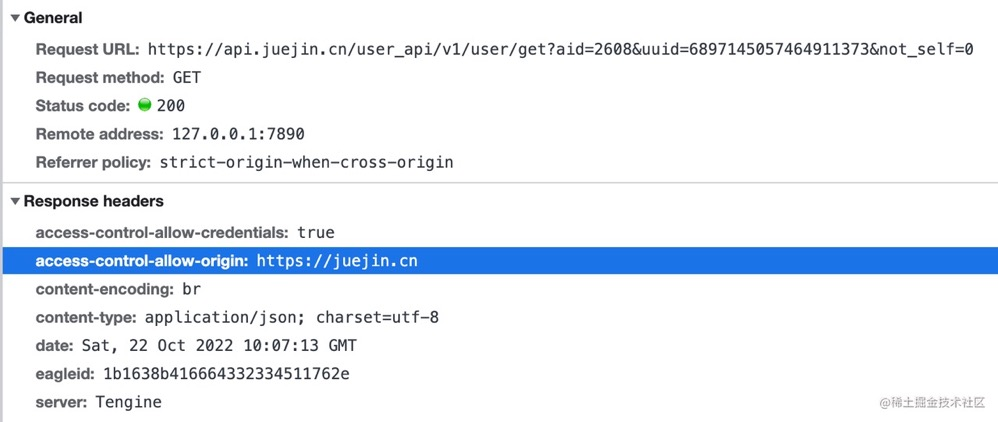

# 跨域与 CORS

跨域问题是**浏览器环境中的特有问题**，，在服务器发起 HTTP 请求不会有跨域问题。
发送请求时，协议，域名，端口，三者有一个不一样，就是跨域。

- 案例一：shanyue.tech 与 q.shanyue.tech 是跨域
- 案例二：shanyue.tech 与 shanyue.tech:3000 是跨域
- 案例三：<http://shanyue.tech> 与 <https://shanyue.tech> 是跨域

## 如何解决跨域

目前有两种最常见的解决方案：

1. CORS，在服务器端设置几个响应头，如 Access-Control-Allow-Origin: \*，最为常见
2. Reverse Proxy，在 nginx/traefik/haproxy 等反向代理服务器中设置为同一域名

附代码: nginx 关于跨域的配置

```js
server {
  listen 80;
  server_name shanyue.tech;

  location / {
    # 避免非root路径404
    try_files $uri $uri/ /index.html;
  }

  # 解决跨域
  location /api {
    # 或者是 http://localhost:8080
    proxy_pass http://api.shanyue.tech;
  }
}
```

## CORS

CORS，Cross-Origin Resource Sharing，跨域资源共享是一种基于 HTTP 响应头的机制，简而言之，就是在服务器端的响应中加入几个响应头，使得浏览器能够跨域访问资源。

> 注意，CORS 规范不在 [HTTP RFC](https://www.rfc-editor.org/rfc/rfc9110.html) 规范上，而在 whatwg 的 [Fetch API](https://fetch.spec.whatwg.org/#http-responses) 规范，whatwg 是 HTML/DOM 规范。

这个响应头的字段设置就是 Access-Control-Allow-Origin，有以下语法。

- 配置为 \* 允许所有域名的资源进行访问
- 配置为某域名，允许该域名的资源进行访问

**注意，该字段没有配置多个域名的语法。**

以下是最简单的一个 CORS 请求：允许 <https://juejin.cn> 访问 <https://api.juejin.cn> 的跨域资源。



## 作业

1. 什么是跨域

   发送请求时，协议，域名，端口，三者有一个不一样，就是跨域

2. 使用 CORS 如何解决跨域

   配置服务端响应头 Access-Control-Allow-Origin：

   - 配置为 \* 允许所有域名的资源进行访问
   - 配置为某域名，允许该域名的资源进行访问

3. CORS 全称是什么

   跨资源共享（CrossOriginResourceSharing）
