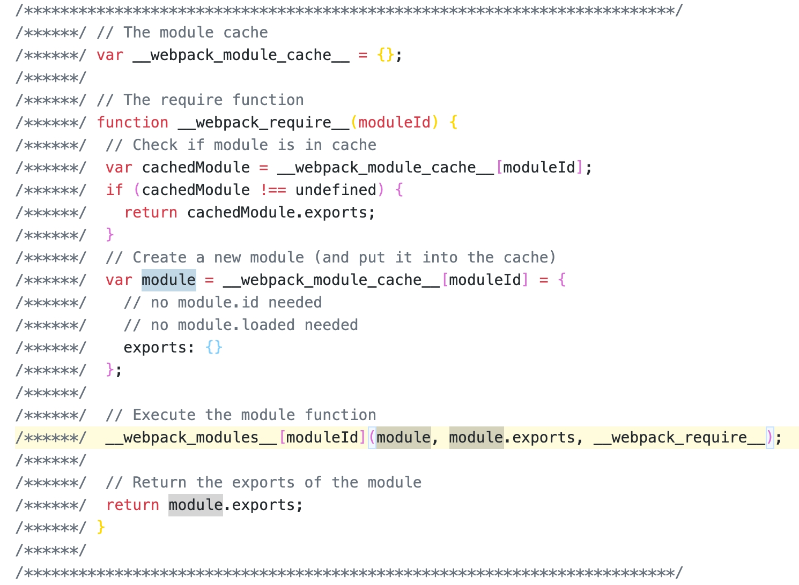
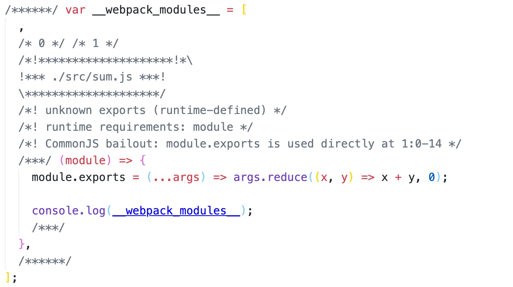

# cjs 运行时分析

使用 webpack 对最简单的静态资源打包，观察其配置与运行时代码。
我们使用 webpack 打包两个文件，index.js 与 sum.js，并通过脚本文件 build.js 进行打包。

> 源码见 [node-examples:webpack/cjs](https://github.com/shfshanyue/node-examples/tree/master/engineering/webpack/cjs)

以下是 index.js 文件内容：

```js
const sum = require('./sum')

console.log(sum(3, 8))
```

以下是 sum.js 文件内容：

```js
module.exports = (...args) => args.reduce((x, y) => x + y, 0)
```

同时编写脚本文件 build.js ，执行该脚本用以打包，这是 webpack 的最简单配置，也是它的最主要功能。

```js
webpack({
  entry: './index.js',
  mode: 'none',
  output: {
    iife: false,
    pathinfo: 'verbose',
  },
})
```

## webpack 运行时代码

在前端，经常会听到一个词：打包器。而 webpack 是其中影响力最大的打包器。
如以上示例，index.js 和 sum.js 两个文件将被打包成 dist/main.js 一个文件。
dist/main.js 的骨架代码包含了一些 webpack 如何将多个模块集合在一起的代码，被称为运行时代码。

> main.js 文件内容见 [main.js](https://github.com/shfshanyue/node-examples/blob/master/engineering/webpack/cjs/example/main.js)，总共 55 行。

为了更好地理解运行时代码，可在 vscode/chrome 中对其文件进行调试三遍以上，可参考 vscode debug。

> Tip：通过 node dist/main.js 可直接执行运行时代码。并基于此在 VSCodde 中调试。

```js
/******/ var __webpack_modules__ = [
  ,
  /* 0 */ /* 1 */
  /*!****************!*\
  !*** ./sum.js ***!
  \****************/
  /*! unknown exports (runtime-defined) */
  /*! runtime requirements: module */
  /*! CommonJS bailout: module.exports is used directly at 1:0-14 */
  /***/ (module) => {
    module.exports = (...args) => args.reduce((x, y) => x + y, 0)

    /***/
  },
  /******/
]
/************************************************************************/
/******/ // The module cache
/******/ var __webpack_module_cache__ = {}
/******/
/******/ // The require function
/******/ function __webpack_require__(moduleId) {
  /******/ // Check if module is in cache
  /******/ var cachedModule = __webpack_module_cache__[moduleId]
  /******/ if (cachedModule !== undefined) {
    /******/ return cachedModule.exports
    /******/
  }
  /******/ // Create a new module (and put it into the cache)
  /******/ var module = (__webpack_module_cache__[moduleId] = {
    /******/ // no module.id needed
    /******/ // no module.loaded needed
    /******/ exports: {},
    /******/
  })
  /******/
  /******/ // Execute the module function
  /******/ __webpack_modules__[moduleId](module, module.exports, __webpack_require__)
  /******/
  /******/ // Return the exports of the module
  /******/ return module.exports
  /******/
}
/******/
/************************************************************************/
var __webpack_exports__ = {}
// This entry need to be wrapped in an IIFE because it need to be isolated against other modules in the chunk.
;(() => {
  /*!******************!*\
  !*** ./index.js ***!
  \******************/
  /*! unknown exports (runtime-defined) */
  /*! runtime requirements: __webpack_require__ */
  const sum = __webpack_require__(/*! ./sum */ 1)

  sum(3, 8)
})()
```

为了方便理解，我将其中的关键代码格式化并重新注释了一遍。

```js
// 维护一个所有模块的数组。
var __webpack_modules__ = ([
// moduleId=0 的模块空缺，可理解为 index.js 即是 0 号模块
,
// 每个模块都由一个包裹函数 (module, module.exports, __webpack_require__) 对模块进行包裹构成，这也是 CommonJS 模块的基础，详见 CommonJS 的 module wrapper
((module) => {
// moduleId=1 的模块，即 sum.js，此处没有做任务代码转译的工作
module.exports = (...args) => args.reduce((x, y) => x + y, 0)
})
]);

// 模块缓存
var __webpack_module_cache__ = {};

// 实现一个模块加载器，模拟实现 CommonJS 的 require
function __webpack_require__(moduleId) {
var cachedModule = __webpack_module_cache__[moduleId];

if (cachedModule !== undefined) {
// 如果该模块存在缓存，则直接在缓存中读取模块的 exports
return cachedModule.exports;
}

// 对该模块进行缓存，注意 module.exports 是引用对象，稍后将对其赋值
var module = __webpack_module_cache__[moduleId] = {
exports: {}
};

// 1. 执行模块内容，此时每一个模块是包裹函数，三个参数分别是 module、module.exports、__webpack_require__，详见 CommonJS 的包裹函数
// 2. 在模块中执行 module.exports = xxx 的过程，将获取到模块的 exports，最后返回
// 3. 此处容易得到在 CommonJS 中 module 与 exports 的关系
__webpack_modules__[moduleId](module, module.exports, __webpack_require__);

// require 的过程，其实就是执行函数并得到 module.exports 的过程
return module.exports;
}

var __webpack_exports__ = {};

// 此处是一个立即执行函数
(() => {
// 1. index.js，即入口文件的内容，直接执行
// 2. 如果将 index.js 该模块视为 moduleId=0 的模块，则该立即执行函数等同于 __webpack_require__(0)
// 3. 注意这里 require(sum) 时，已经变成了 require sum.js 的 moduleId
const sum = __webpack_require__(/_! ./sum _/ 1)
sum(3, 8)
})();
```

## 运行时代码分析

webpack 的 runtime，也就是 webpack 最后生成的代码，做了以下三件事:

1. `__webpack_modules__`: 维护一个所有模块的数组。将入口模块解析为 AST，根据 AST 深度优先搜索所有的模块，并构建出这个模块数组。每个模块都由一个包裹函数 `(module, module.exports, __webpack_require__)` 对模块进行包裹构成。从代码中可以看出来 id 为 0 的模块为入口模块，id 为 1 的模块为 sum.js 模块。
2. `__webpack_require__(moduleId)`: 手动实现加载一个模块。对已加载过的模块进行缓存，对未加载过的模块，执行 id 定位到 `__webpack_modules__` 中的包裹函数，执行并返回 `module.exports`，并缓存。
3. `__webpack_require__(0)`: 运行第一个模块，即运行入口模块。
   除此之外，还有一个变量：
4. `__webpack_module_cache__`：模块缓存，确保每个模块只能被执行一次，在 HMR 时进行热加载时，将会清楚对应的 module 缓存
   Q：你了解 Node.js 中的 module wrapper 吗？你会发现 `__webpack_modules__` 中的模块与此十分相似。
   另外，当涉及到多个 chunk 的打包方式中，比如 `code spliting`，webpack 中会有 jsonp 加载 chunk 的运行时代码，后续再做分析。
   关于 webpack 运行时的所有变量可见源码：<https://github.com/webpack/webpack/blob/main/lib/RuntimeGlobals.js>
   对 `webpack runtime` 做进一步精简，代码如下。

```js
const __webpack_modules__ = [
  () => {
    console.log(10)
  },
]
const __webpack_require__ = (id) => {
  const module = { exports: {} }
  const m = __webpack_modules__[id](module, __webpack_require__)
  return module.exports
}

__webpack_require__(0)
```

由上可见，webpack 运行时中，最重要的一个环节是 `__webpack_modules__` 的生成，那它是如何生成的呢？

请见下一章 AST。

## 作业

1. 对 webpack 运行时代码进行调试三遍并理解

   ok

2. webpack 的模块加载器是如何实现的

   
   首先定义全局缓存对象`__webpack_module_cache__`
   然后定义打包器函数`__webpack_require__(moduleId){}`
   函数中：
   首先根据 moduleId 读取全局缓存对象
   如果存在缓存，则直接返回缓存模块的 exports 对象
   如果不存在缓存，创建新的模块对象，首先根据 moduleId 放入缓存，然后赋值给局部模块对象，此时局部模块对象仅有 exports 属性
   然后根据 moduleId 读取全局模块数组，执行该模块函数并传入函数里的局部模块对象，拿到指定模块的 exports 值
   最后导出该模块的 exports 值

3. webpack 的运行时代码做了那些事情

   首先定义全局模块数组，将模块用带参数的函数包裹并根据 moduleId 放入数组的第一个位置后，第一个位置为入口模块 `__webpack_modules__`
   然后定义模块加载器，可以根据 moduleId 执行模块，并返回模块的 exports 值 `__webpack_require__`(moduleId){}
   最后执行模块加载器加载入口模块`__webpack_require__(0)`

4. CommonJS 中，如果不对 module 进行缓存有什么问题，即不实现以上的 `__webpack_module_cache__` 数据结构

   1. 避免模块反复生成
   2. 单例模式，每个模块只在第一次被引用时产出模块对象，之后的引用都是同一个对象。

5. 阅读 webpack 模块加载器代码，我们在 CommonJS 中使用 `module.exports` 与 `exports` 有何区别

   module.exports 是访问 module 的 exports 属性的值，exports 是该值的引用，即类似于`const exports=module.exports`

6. 如何理解 webpack 运行时代码最后是 `__webpack_require__(0)`

   
   
   执行打包后的 js 然后打印`__webpack_modules__`发现 0 的位置是空的
   所以其实 0 只是一个预留位置
   解释成是储存入口模块可能更容易理解
   且因为`__webpack_modules__`是根据文件的依赖关系进行深度优先遍历得来的数组，所以根节点即入口文件即 0 位置的模块
