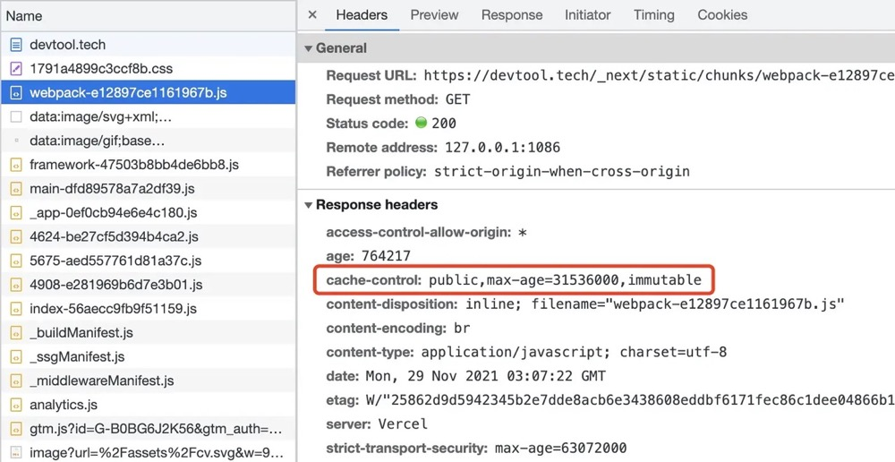

# 文件名中的 hash

使用 webpack 等打包器进行打包时，每个资源都可以生成一个带有 hash 的路径，如 main.071b73.js，在 webpack 中通过 output.filename 进行配置，配置如下。

> 源码见 [node-examples:webpack/cjs](https://github.com/shfshanyue/node-examples/tree/master/engineering/webpack/cjs) 中 f4 函数

```js
{
  output: {
    filename: '[name].[contenthash:6].js'
  }
}
```

> Q：此处 chunkhash 与 contenthash 有何区别？以后再讲。

此处对添加 hash 的资源设置长期强缓存，一般为一年时间，可大幅度提高该网站的 HTTP 缓存能力，从而大幅度提高网站的二次加载性能。

> Q：你知道如何配置强缓存，并验证生效吗？

通过在服务器端对资源设置以下 Response Header，进行强缓存一年时间，称为长期缓存，即 Long Term Cache。

```bash
Cache-Control: public,max-age=31536000,immutable
```

**而当源文件内容发生变更时，资源的 hash 发生变化，生成新的可永久缓存的资源地址。**
因此在实践中，可对打包处理后带有 hash 资源的所有文件设置长期缓存。可在浏览器控制台 Network 中查看响应头来验证所属项目是否已成功添加长期缓存。


## 将版本号放在文件名中？

```js
const package = require('./package.json')

const config = {
  output: {
    filename: `${package.version}.{hash}.js`,
  },
}
```

思考一下，可以将我们项目的版本号注入我们的文件名吗？
千万不要这样做！
因为每次版本号的改变，这将**导致所有缓存都失效**，而每次版本升级时，并不是所有资源内容都会进行变更。

## hash 是如何生成的？

在 webpack 中，默认使用 md4 hash 函数，它将基于模块内容以及一系列元信息生成摘要信息。
对于 hash 算法的一部分代码可参考 NormalModule 的 hash 函数。

```js
_initBuildHash(compilation) {
  const hash = createHash(compilation.outputOptions.hashFunction);
  if (this._source) {
    hash.update("source");
    this._source.updateHash(hash);
  }
  hash.update("meta");
  hash.update(JSON.stringify(this.buildMeta));
  this.buildInfo.hash = /** @type {string} */ (hash.digest("hex"));
}
```

选择一个更加快速的 hash 函数，即可减少 CPU 消耗，并提升打包速度。比如将默认的 md4 换成 xxhash64

1. 在 next.js 中，webpack 的 hash 函数已默认为 xxhash64，见源码：<https://github.com/vercel/next.js/blob/canary/packages/next/build/webpack-config.ts#L1426>
2. 在 vue-cli 中，webpack 的 hash 函数已默认为 xxhash64 ，见源码：<https://github.com/vuejs/vue-cli/blob/v5.0.8/packages/@vue/cli-service/lib/config/base.js#L14>
   在 webpack 中，可通过 output.hashFuction 来配置 hash 函数。见 output.hashFunction 官方文档
   Tip：这是面试问题如何提升 webpack 打包速度，八股文不常有的答案。其中，在 next.js 源码中也做了这样的优化，见 Next.js 源码
   同时在实例文件中对二者进行了对比。

```js
function f5() {
  return webpack([
    {
      entry: './index.js',
      mode: 'none',
      output: {
        filename: 'main.[contenthash:6].md4.js',
        hashFunction: 'md4',
      },
    },
    {
      entry: './index.js',
      mode: 'none',
      output: {
        filename: 'main.[contenthash:6].xxhash64.js',
        hashFunction: 'xxhash64',
      },
    },
  ])
}
```

## 作业

1. 什么是 Long Term Cache，有何作用

   在服务器对响应头设置 cache-control 的值来达到最大化缓存时间，一般指一年时间或者两年时间

2. 为什么配置 output.filename 时不建议注入版本号

   因为会导致更新版本时所有文件名变化，当文件名变更时会重新进行缓存，那么更新版本会导致所有缓存失效，但是更新版本一般并不会更新所有文件

3. 为什么可以配置 Long Term Cache

   因为 webpack 打包时可以配置 contenthash,只改变改变内容的文件的 hash 值，新的文件会重新进行缓存，不会导致版本问题

4. 如何提升 webpack 编译时期计算 hash 的速度

   通过 output.hashFunction 属性,webpack5 已经支持直接配置’xxhash64‘
   [根据此方法对 umi 进行了优化](https://github.com/umijs/umi/pull/9168#event-7302069734)

5. 在 Node.js 中如何进行 hash 计算

   参考大佬的回答，是用 crypto 库
