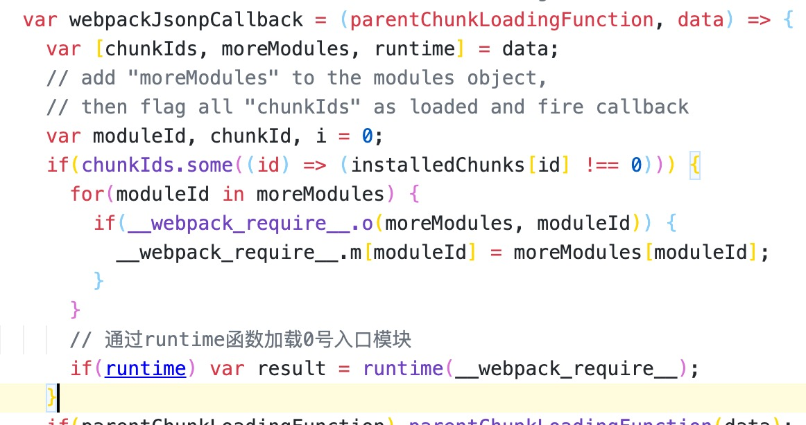

# hash 的增强

在前序文章 webpack 中的 hash 中提到，为生成的资源生成 hash 值可配置永久缓存，提高网站的二次加载性能。
其中还有一点，当特定的代码发生变更，将只会影响到该代码所涉及的打包资源路径的改变，以下举例说明：
以我们在 code spliting 时的示例代码为例，源码见 code-spliting。

```js
// index.js 内容
import('./sum').then((m) => {
  console.log(m.default(3, 4))
})

// sum.js 内容
const sum = (...args) => args.reduce((x, y) => x + y, 0)

export default sum
```

由于 import('./sum') 造成代码分割，第一次打包生成资源：

- main.111111.js
- sum.111111.js
  当我们对源码 index.js 做如下更改

```js
// 无以下两行代码为第一次打包，添加以下两行代码为第二次打包
import _ from 'lodash'
console.log(_.get)

import('./sum').then((m) => {
  console.log(m.default(3, 4))
})
```

再次打包生成资源：

- main.222222.js
- sum.222222.js
  我们会发现，随着 index.js 源码内容的变更，不仅 main.js 路径发生了变更，而且 sum.js 的路径也发生了变更。
  原因如下:

1. `__webpack_require__.m` 中模块顺序的变更，从中插入了 lodash 模块
2. `__webpack_require__.u` 该函数受 async chunk 路径影响，由于模块顺序的改变导致了 sum.js chunk 中的 moduleId 改变，因此路径发生变化
   第二点在文章 code spliting 运行时分析 已经进行了阐明，而第一点主要是因为每个模块的 `moduleId` 的不确定性。
   首次构建的 `__webpack_require__.m` 数组：

- index.js -> 0
  - sum.js -> 1
    更改代码后第二次构建的 `__webpack_require__.m` 数组
- index.js -> 0
  - lodash -> 1
  - sum.js -> 2
    其中 sum.js 及其后所有模块（由于该示例仅有两个模块，未显示出来）的 moduleId 发生变更，导致每次 import sum from './sum' 或者 require('./sum') 时代码都会发生变更。

```js
// 代码更改前
__webpack_require__(1)

// 代码更改后
__webpack_require__(2)
```

本篇文章将阐述如何解决以上两个问题

1. moduleId 的不确定性
2. **webpack_require**.u 受 async chunk 路径的影响导致 entry chunk 路径变更

## deterministic

实际上除了 moduleId 的不确定性，chunkId 也存在不确定性，将 index.js 内容修改如下，必然会影响到 chunkId 的顺序。

```js
// 无以下一行代码为第一次打包，添加以下一行代码为第二次打包
import('lodash')

import('./sum').then((m) => {
  console.log(m.default(3, 4))
})
```

实际上，在 webpack 中，可通过 optimization 来优化该问题，使得每一个模块以及 chunk 都能获得确定的 id。

```js
{
  optimization: {
    moduleIds: 'deterministic',
    chunkIds: 'deterministic'
  }
}
```

示例代码可见 code-spliting 的 f4 函数。

```js
// 通过配置 deterministic，可获得确定的 moduleId 与 chunkId
function f4 () {
  return webpack({
    entry: './index.js',
    mode: 'none',
    output: {
      filename: '[name].[contenthash].js',
      chunkFilename: 'chunk.[name].[id].[contenthash].js',
      path: path.resolve(__dirname, 'dist/deterministic')
    },
    optimization: {
      moduleIds: 'deterministic',
      chunkIds: 'deterministic'
    }
  })
}
```

但是这一点有可能不需要你手动配置，**在生产环境下，二者将被 webpack 默认配置为 deterministic**。
见源码如下：<https://github.com/webpack/webpack/blob/main/lib/config/defaults.js#L1137>

```js
F(optimization, 'moduleIds', () => {
  if (production) return 'deterministic'
  if (development) return 'named'
  return 'natural'
})
F(optimization, 'chunkIds', () => {
  if (production) return 'deterministic'
  if (development) return 'named'
  return 'natural'
})
```

## runtimeChunk

接下来便是第二个问题，问题核心出在以下的 `__webpack_require__.u` 函数中。

```js
// 由于在 entry chunk 中包含 async chunk 的地址，因为当 async chunk 内容发生变更时，entry chunk 路径也会发生变更。
__webpack_require__.u = (chunkId) => {
  return '' + chunkId + '.' + chunkId + '.chunk.' + 'f64a38ddcbde85380cf2' + '.js'
}
```

此时 index.js 与 webpack 运行时的代码（即 webpack 的骨架代码）糅合在一起，为了最小化 `__webpack_require__.u` 内容改变的影响，可将 webpack 运行时单独分割出去。
在 webpack 中，可通过 `optimization.runtimeChunk: true` 解决该问题。

```js
{
  optimization: {
    runtimeChunk: true
  }
}
```

示例代码可见 code-spliting 的 f5 函数。

```js
// 当 runtimeChunk 设置为 true 时，将单独把 webpack 的运行时给独立出来
function f5() {
  return webpack({
    entry: './index.js',
    mode: 'none',
    output: {
      filename: '[name].[contenthash].js',
      chunkFilename: '[name].[contenthash].chunk.js',
      path: path.resolve(__dirname, 'dist/runtime'),
    },
    optimization: {
      moduleIds: 'deterministic',
      chunkIds: 'deterministic',
      runtimeChunk: true,
    },
  })
}
```

再次构建打包，将会生成三个 chunk，对应打包后的三个资源

```bash
$ ls -lh dist/runtime
total 48
-rw-r--r--  1 shanyue  staff   565B Sep  9 17:40 main.64655ed4e3da294cd1ae.js
-rw-r--r--  1 shanyue  staff    12K Sep  9 17:40 runtime~main.da0035d028df96832d8f.js
-rw-r--r--  1 shanyue  staff   522B Sep  9 17:40 sum.cd6471f79c0bc4b3a4fb.chunk.js
```

那把 runtimeChunk 单独分离出来后，如何继续运行代码呢？
此处关键便是 JSONP 回调函数的第三个参数，用来运行入口模块，以下是 webpackJsonpCallback 的实现

```js
var webpackJsonpCallback = (parentChunkLoadingFunction, data) => {
  var [chunkIds, moreModules, runtime] = data
  var moduleId,
    chunkId,
    i = 0
  if (chunkIds.some((id) => installedChunks[id] !== 0)) {
    // ...省略部分无关代码
    // 如果包含第三个参数，则传递 __webpack_require__，加载入口模块
    if (runtime) var result = runtime(__webpack_require__)
  }
  // ...省略部分无关代码
}
```

而 index.js 入口模块对应的 chunk 中，第三个参数的核心内容即是运行入口模块

```js
;(self['webpackChunk'] = self['webpackChunk'] || []).push([
  [179],
  {
    560: (__unused_webpack_module, __unused_webpack_exports, __webpack_require__) => {
      __webpack_require__
        .e(/* import() | sum */ 644)
        .then(__webpack_require__.bind(__webpack_require__, 709))
        .then((m) => {
          console.log(m.default(3, 4))
        })
    },
  },
  (__webpack_require__) => {
    // 运行入口模块内容，即运行 index.js 内容
    var __webpack_exec__ = (moduleId) => __webpack_require__((__webpack_require__.s = moduleId))
    var __webpack_exports__ = __webpack_exec__(560)
  },
])
```

运行时代码可简化为 **webpack_require**(560)，与专栏 CommonJS 运行时分析 文章中的 **webpack_require**(0)，是何等相似。
而此时又多了一个对象属性

- `__webpack_require__.s` 代表入口模块的 moduleId
  见源码：<https://github.com/webpack/webpack/blob/main/lib/RuntimeGlobals.js#L56>

```js
exports.entryModuleId = '__webpack_require__.s'
```

## 作业

1. 理解 deterministic chunkIds/moduleIds，以及什么情况下 id 会发生变更
   当模块加载顺序发生改变，模块顺序会发生改变，moduleIds 随之改变，而同时`__webpack_require__.u`读取到的 chunkId 随 moduleIds 改变，即 chunkIds 改变
2. 如有余力，阅读源码查看 deterministic 在 webpack 的内部实现
   根据大佬作业，只要模块的路径和文件名不做更改，那么 deterministic 后的 hash 值就是稳定的
3. 理解 runtimeChunk 选项，阅读其源码，理解它是如何运行代码的

   

4. 阅读常见的社区以及自己公司的脚手架代码，观察是否配置了以上优化选项，如果没有，考虑是否可贡献代码

   [umi 已提交 pr，正在修改中](https://github.com/umijs/umi/pull/9541)
