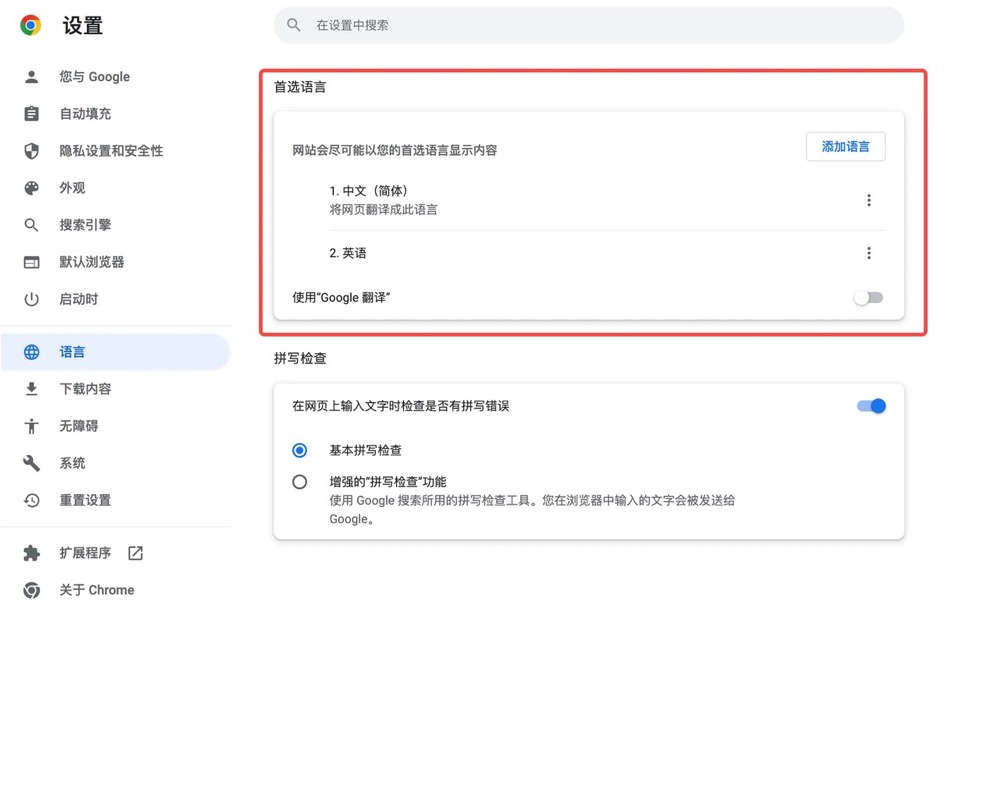

# 内容协商

内容协商，客户端与服务期端协商需要什么样的资源，比如语言（中文/英文）、压缩编码以及媒体类型，如果服务器无法返回对应的资源，则返回 406 状态码。


图片来自 MDN 内容协商

## 请求头

关于内容协商的请求头有以下几个：

- Accept：我（客户端）需要什么样的 MIME 资源，比如 json 与 html，不较常见
- Accept-Language：我需要什么样的语言，比如 en-US 和 zh-CN，较为常见
- Accept-Encoding：我需要什么样的压缩编码，比如 gzip 与 br，如果不配置则可能不进行压缩，非常常见

## Accept 格式

```bash
 Accept: text/html, application/xhtml+xml, application/xml;q=0.9, _/_;q=0.8

# 为了便于理解，我使用括号进行分组，括号仅仅是为了理解！

## Accept: (text/html), (application/xhtml+xml), (application/xml;q=0.9), (_/_;q=0.8)
```

注意，比较反直觉的是，在 HTTP Header 中，, 拥有比 ; 更高的优先级，根据, 分组，而不是根据 ; 分组，这有可能让一些人无所适从。

## Accept

Accept 协商 Content-Type，在国外 API 文档较为常见，比如 Github API，它允许配置以下两种 MIME Type

- application/vnd.github.text+json：仅仅返回 Markdown
- application/vnd.github.html+json：仅仅返回 HTML
  比如，在 Github Issue 中，通过 markdown 进行书写 Issue，可通过内容协商控制返回 Markdown/HTML 的一种。
  > vnd，vendor 简写，由供应商自定义 MIME Type，见 RFC 6838，随后紧跟供应商名称与其自定义的类型，比如 Github 的 application/vnd.github.text+json 以及微软的 application/vnd.ms-excel。
  > 可见示例

```bash
# jq 为 JSON 处理工具，以下语句意为只打印 body body_html body_text 三个字段

# 选择 html 内容进行返回，则可以看到返回的 .body_html 字段

$ curl -s \
 -H "Accept: application/vnd.github.html+json" \
 https://api.github.com/repos/shfshanyue/Daily-Question/issues/1 | jq "{ body, body_html, body_text }"
{
"body": null,
"body_html": "<p dir=\"auto\">网站开发中，如何实现图片的懒加载，随着 web 技术的发展，他有没有一些更好的方案</p>",
"body_text": null
}

# 选择 text 内容进行返回，则可以看到返回的 .body_text 字段

$ curl -s \
 -H "Accept: application/vnd.github.text+json" \
 https://api.github.com/repos/shfshanyue/Daily-Question/issues/1 | jq "{ body, body_html, body_text }"
{
"body": null,
"body_html": null,
"body_text": "网站开发中，如何实现图片的懒加载，随着 web 技术的发展，他有没有一些更好的方案"
}
```

## Accept-Language

Accept Language 协商语言，常用作国际化。
比如，MDN 会通过判断请求中的 Accept，来判断给出那种语言的版本。

```bash
# 如果请求的语言是中文版本，则重定向至 /zh-CN/ 中文版页面

$ curl -I https://developer.mozilla.org/ -H 'Accept-Language: zh'
HTTP/2 302
content-length: 0
location: /zh-CN/

# 如果请求的语言是英语版本，则重定向至 /zh-US/ 英文版页面

$ curl -I https://developer.mozilla.org/ -H 'Accept-Language: en'
HTTP/2 302
content-length: 0
location: /en-US/
```

而在浏览器中发送请求时，通过配置页面的语言配置，来控制发送 Accept Language 请求头，见下截图


语言配置也可以通过 API 拿到，通过此可进行 i18n 配置，作为其默认语言，这比通过前端界面选择语言要友好许多：

```javascript
navigator.language
```

## Accept-Encoding

控制压缩编码，比如 gzip 与 br，如果不配置则可能不进行压缩。可通过响应头 Content-Encoding 查看压缩编码。

```bash
$ curl -I https://juejin.cn <<<
HTTP/2 200
content-type: text/html; charset=utf-8
content-length: 58565
vary: Accept-Encoding

$ curl -I https://juejin.cn -H 'Accept-Encoding: gzip'
HTTP/2 200
server: Tengine
content-type: text/html; charset=utf-8
content-encoding: gzip
vary: Accept-Encoding

$ curl -I https://juejin.cn -H 'Accept-Encoding: br' <<<
HTTP/2 200
content-type: text/html; charset=utf-8
vary: Accept-Encoding
content-encoding: br
```

## 反爬

```bash
accept: text/html,application/xhtml+xml,application/xml;q=0.9,image/avif,image/webp,image/apng,_/_;q=0.8,application/signed-exchange;v=b3;q=0.9
accept-encoding: gzip, deflate, br
accept-language: zh-CN,zh;q=0.9,en;q=0.8
```

在浏览器中会自动发送 Accept、Accept-Encoding 以及 Accept-Language 三个请求头，如上所示。
因此一些安全性要求较高的网站，将通过以上三个请求头是否存在判断请求方是浏览器还是爬虫。如果不存在以上请求头，则直接拒绝请求。

## 作业

1. 什么是内容协商

   客户端与服务期端协商需要什么样的资源,客户端通过以下请求头进行协商

   - Accept
   - Accept-Language
   - Accept-Encoding

2. Accept 如何配置权重

   , 拥有比 ; 更高的优先级，根据, 分组，而不是根据 ; 分组

3. Accept/Accept-Language/Accept-Encoding 三个请求头的应用场景

   - Accept：我（客户端）需要什么样的 MIME 资源，比如 json 与 html，不较常见
   - Accept-Language：我需要什么样的语言，比如 en-US 和 zh-CN，较为常见
   - Accept-Encoding：我需要什么样的压缩编码，比如 gzip 与 br，如果不配置则可能不进行压缩，非常常见
