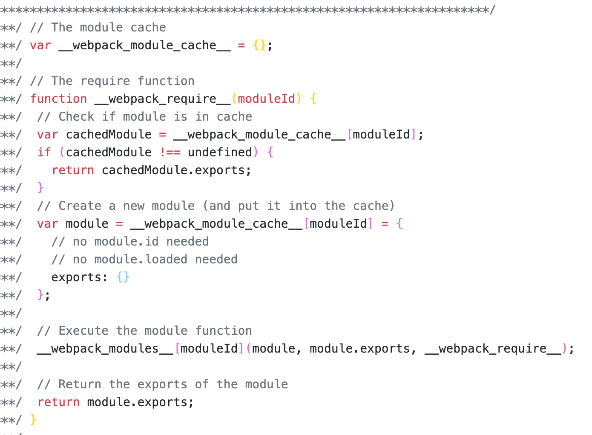
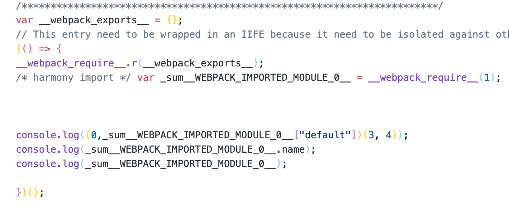

# esm to cjs

虽然现代主流浏览器已支持 ESM，但 webpack 仍然会将 ESM 转化为 CommonJS，并注入到运行时代码。
那 webpack 是如何将 ESM 转化为 CommonJS 的？或者说含有 ESM 的运行时代码是什么样子的？

> 源码见 [node-examples:webpack/es](https://github.com/shfshanyue/node-examples/tree/master/engineering/webpack/es)

## 示例代码

在 esm 中，导入导出有两种方式:

- 具名导出/导入: Named Import/Export
- 默认导出/导入: Default Import/Export
  以下是 index.js 文件内容：

```js
import sum, { name } from './sum'
import * as s from './sum'

console.log(sum(3, 4))
console.log(name)
console.log(s)
```

以下是 sum.js 文件内容：

```js
const sum = (...args) => args.reduce((x, y) => x + y, 0)

export default sum
export const name = 'sum'
```

## 转化

由于在 esm 中，有两种导入导出的方式，但是在 cjs 中只有一种。
因此在转化时，将 default import/export 转化为 module.exports.default，而 named import/export 转化为 module.exports 对应的属性。
示例如下：

```js
// esm 代码
import sum, { name } from './sum'
import * as s from './sum'

// 转化后的 cjs 代码
const s = require('./sum')
const sum = s.default
const name = s.name
```

## ESM 运行时代码

分析其运行时代码，相对于 CommonJS 而言，在 `__webpack_require__` 中多了几个属性，代码如下：

> 源码见 node-examples:webpack/es，执行 node build.js 可见运行时代码。main.js 文件内容见 main.js，总共 93 行，相对比 CommonJS 的 55 行，多了一半有余。

```js
/* webpack/runtime/define property getters */
;(() => {
  // define getter functions for harmony exports
  __webpack_require__.d = (exports, definition) => {
    for (var key in definition) {
      if (__webpack_require__.o(definition, key) && !__webpack_require__.o(exports, key)) {
        Object.defineProperty(exports, key, { enumerable: true, get: definition[key] })
      }
    }
  }
})()

/* webpack/runtime/hasOwnProperty shorthand */
;(() => {
  __webpack_require__.o = (obj, prop) => Object.prototype.hasOwnProperty.call(obj, prop)
})()

/* webpack/runtime/make namespace object */
;(() => {
  // define __esModule on exports
  __webpack_require__.r = (exports) => {
    if (typeof Symbol !== 'undefined' && Symbol.toStringTag) {
      Object.defineProperty(exports, Symbol.toStringTag, { value: 'Module' })
    }
    Object.defineProperty(exports, '__esModule', { value: true })
  }
})()
```

多的三个函数属性总计如下：

- `__webpack_require__.d`：使用 getter/setter 用以定义 exports 的属性
- `__webpack_require__.r`：`exports.__esModule = true`，用以标记一个 ESM 模块
- `__webpack_require__.o`：`Object.prototype.hasOwnProperty` 的简写
  sum 模块的源码与 webpack 运行时的代码对比如下：

```js
// 源码
const sum = (...args) => args.reduce((x, y) => x + y, 0)

export default sum
export const name = 'sum'(
  // 运行时代码
  // 该模块被 module_wrapper 包裹
  (__unused_webpack_module, __webpack_exports__, __webpack_require__) => {
    // 1. 标记该模块是一个 ESM 模块
    __webpack_require__.r(__webpack_exports__)

    // 2. 导出所有的属性，即 __webpack_exports__，但通过 getter/setter 方式，可以懒加载属性
    __webpack_require__.d(__webpack_exports__, {
      default: () => __WEBPACK_DEFAULT_EXPORT__,
      name: () => /* binding */ name,
    })

    // 3. 执行代码，配置 getter/setter 的属性
    const sum = (...args) => args.reduce((x, y) => x + y, 0)

    // 即 export default
    const __WEBPACK_DEFAULT_EXPORT__ = sum

    const name = 'sum'
  }
)
```

1. 包裹函数同样由 `(module, module.exports, __webpack_require__)` 包裹而成
2. `__webpack_require__.r` 标记其为 ESM 模块
3. `__webpack_require__.d` 定义其所有导出的值
4. `__WEBPACK_DEFAULT_EXPORT__` 常量标记 export default

## 作业

1. 对含 ESM 模块的 webpack 运行时代码进行调试与理解

   ok

2. webpack 含 ESM 的运行时代码做了那些事情

   首先根据 ast 生成的`__webpack_module__`的中用`__webpack_require__`的属性方法，r 给 `__webpack_exports__`添加鉴别是 esm 模块的属性，d 将导出的属性用 getter(setter)定义，
   属性在下方声明是因为访问时已经赋值
   

   缓存和`__webpack_require__`同 cjsm 模块
   

   定义`__webpack_require__`的属性方法，r,d,o
   

   先和`__webpack_module__`中模块一样执行 r,给入口模块添加 esm 标签，然后调用`__webpack_require__`返回 sum 模块的导出

3. `__webpack_require__` 中的 d/r/o 各个变量指什么意思

   - d:将 esm 导出的变量变成 exports 的 getter/setter 属性
   - r:给 exports 添加一个属性标志这是 esm 模块
   - o:相当于 Object 的 hasOwnProperty 方法
